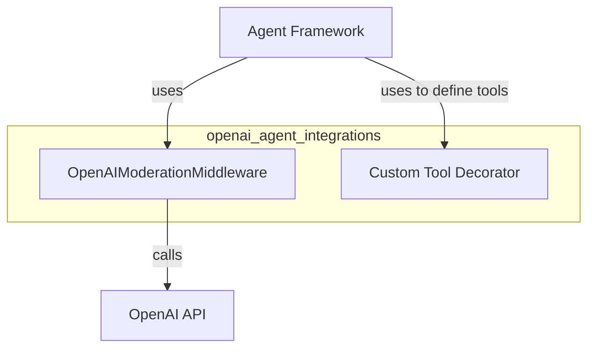

# openai_agent_integrations
This module provides integrations for OpenAI agents, including a middleware for moderating agent traffic and a decorator for defining custom tools.

<!-- DIAGRAM_JSON
{
  "nodes": [
    {"id": "moderation_middleware", "label": "OpenAIModerationMiddleware"},
    {"id": "custom_tool_decorator", "label": "Custom Tool Decorator"},
    {"id": "agent_framework", "label": "Agent Framework"},
    {"id": "openai_api", "label": "OpenAI API"}
  ],
  "edges": [
    {"source": "agent_framework", "target": "moderation_middleware", "label": "uses"},
    {"source": "agent_framework", "target": "custom_tool_decorator", "label": "uses to define tools"},
    {"source": "moderation_middleware", "target": "openai_api", "label": "calls"}
  ],
  "groups": [
    {"id": "openai_agent_integrations_group", "label": "openai_agent_integrations", "nodes": ["moderation_middleware", "custom_tool_decorator"]}
  ]
}
-->
