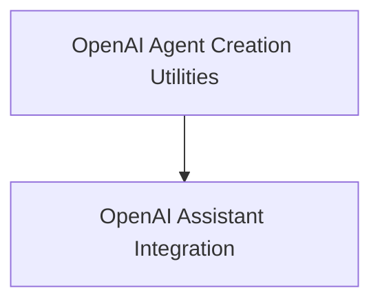

# openai_agents Module Documentation

## Introduction

The `openai_agents` module provides a comprehensive set of tools and utilities for building and managing intelligent agents leveraging OpenAI's advanced capabilities, including Assistants, function calling, and custom tools. This module streamlines the integration of OpenAI models into agent-based applications, enabling complex conversational flows and automated task execution.

## Architecture Overview

The `openai_agents` module is structured into key sub-modules, each focusing on a specific aspect of OpenAI agent functionality. This modular design promotes maintainability and allows for flexible integration into various applications.

<!-- DIAGRAM_JSON
{
    "direction": "TD",
    "nodes": [
        {"id": "openai_agent_creators", "label": "OpenAI Agent Creation Utilities", "type": "module", "link": "openai_agent_creators.md"},
        {"id": "openai_assistant_integration", "label": "OpenAI Assistant Integration", "type": "module", "link": "openai_assistant_integration.md"}
    ],
    "edges": [
        {"source": "openai_agent_creators", "target": "openai_assistant_integration"}
    ],
    "groups": []
}
-->

## Sub-modules

### [OpenAI Agent Creation Utilities](openai_agent_creators.md)
This sub-module provides core functionalities for creating various types of OpenAI-powered agents. It includes functions for generating agents that utilize OpenAI's function calling capabilities, enabling structured interactions and complex task execution.

### [OpenAI Assistant Integration](openai_assistant_integration.md)
This sub-module focuses on integrating with OpenAI Assistants. It offers a `Runnable` interface for seamless interaction with Assistants, supporting both synchronous and asynchronous operations, and managing threads and runs.
