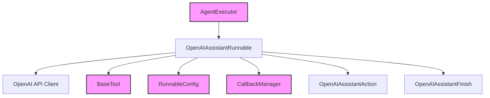

# openai_assistant_integration

The `openai_assistant_integration` module provides a robust and flexible way to interact with the OpenAI Assistant API within the LangChain framework. It offers a `Runnable` interface for creating, managing, and executing OpenAI Assistants, seamlessly integrating their capabilities into your applications.

## Purpose and Core Functionality

The primary purpose of this module is to abstract the complexities of the OpenAI Assistant API, allowing developers to leverage its features through a familiar LangChain `Runnable` pattern. The core component, `OpenAIAssistantRunnable`, enables:

*   **Assistant Creation**: Programmatically create OpenAI Assistants with specified names, instructions, tools, and models.
*   **Conversational Management**: Initiate new conversational threads or continue existing ones with user messages.
*   **Tool Execution**: Handle tool calls required by the Assistant, either through a simple invocation or by integrating with LangChain's `AgentExecutor`.
*   **Asynchronous Operations**: Support for asynchronous invocation, crucial for non-blocking applications.
*   **Flexible Output**: Returns raw OpenAI API responses or LangChain `AgentAction`/`AgentFinish` objects, depending on the configuration.

### `OpenAIAssistantRunnable`

The `OpenAIAssistantRunnable` class is the central component of this module. It inherits from `RunnableSerializable`, making it easy to integrate into LangChain expression language chains.

**Key methods and properties:**

*   `client`: An `OpenAI` or `AzureOpenAI` client instance for synchronous API calls.
*   `async_client`: An `AsyncOpenAI` or `AsyncAzureOpenAI` client instance for asynchronous API calls.
*   `assistant_id`: The ID of the OpenAI Assistant being used.
*   `check_every_ms`: The frequency (in milliseconds) at which to check the progress of an OpenAI run.
*   `as_agent`: A boolean flag that, when `True`, makes the runnable compatible with LangChain's `AgentExecutor` by returning `OpenAIAssistantAction` and `OpenAIAssistantFinish` objects.
*   `create_assistant(...)`: A class method to create a new OpenAI Assistant and return an `OpenAIAssistantRunnable` instance configured with the new assistant's ID.
*   `ainvoke(...)`: Asynchronously invokes the assistant with a given input, managing threads, messages, and runs.
*   `invoke(...)`: Synchronously invokes the assistant with a given input, managing threads, messages, and runs.

## Architecture and Component Relationships

The `openai_assistant_integration` module relies on several external components and integrates with core LangChain modules to provide its functionality.

<!-- DIAGRAM_JSON
{
    "direction": "TD",
    "nodes": [
        {"id": "openai_assistant_runnable", "label": "OpenAIAssistantRunnable", "type": "component", "link": null},
        {"id": "openai_api_client", "label": "OpenAI API Client", "type": "external", "link": null},
        {"id": "agent_executor", "label": "AgentExecutor", "type": "external", "link": "classic_agents.md"},
        {"id": "base_tool", "label": "BaseTool", "type": "external", "link": "core_tools.md"},
        {"id": "runnable_config", "label": "RunnableConfig", "type": "external", "link": "core_runnables.md"},
        {"id": "callback_manager", "label": "CallbackManager", "type": "external", "link": "core_callbacks.md"},
        {"id": "openai_assistant_action", "label": "OpenAIAssistantAction", "type": "component", "link": null},
        {"id": "openai_assistant_finish", "label": "OpenAIAssistantFinish", "type": "component", "link": null}
    ],
    "edges": [
        {"source": "openai_assistant_runnable", "target": "openai_api_client"},
        {"source": "agent_executor", "target": "openai_assistant_runnable"},
        {"source": "openai_assistant_runnable", "target": "base_tool"},
        {"source": "openai_assistant_runnable", "target": "runnable_config"},
        {"source": "openai_assistant_runnable", "target": "callback_manager"},
        {"source": "openai_assistant_runnable", "target": "openai_assistant_action"},
        {"source": "openai_assistant_runnable", "target": "openai_assistant_finish"}
    ],
    "groups": []
}
-->

*   **`OpenAIAssistantRunnable`**: The core component that orchestrates interactions with the OpenAI Assistant API.
*   **OpenAI API Client**: Directly interacts with the OpenAI API for creating assistants, managing threads, and running conversational turns.
*   **`AgentExecutor`**: When `as_agent` is set to `True`, `OpenAIAssistantRunnable` can be used as an agent within an `AgentExecutor` ([classic_agents.md](classic_agents.md)), allowing for advanced agentic workflows.
*   **`BaseTool`**: Tools provided to the OpenAI Assistant can be instances of `BaseTool` ([core_tools.md](core_tools.md)) or dictionaries in OpenAI's tool format.
*   **`RunnableConfig`**: Used to configure the invocation of the runnable, including callbacks, tags, and metadata ([core_runnables.md](core_runnables.md)).
*   **`CallbackManager`**: Handles callbacks during the execution of the runnable, allowing for logging, monitoring, and custom event handling ([core_callbacks.md](core_callbacks.md)).
*   **`OpenAIAssistantAction` / `OpenAIAssistantFinish`**: Internal data structures returned when `OpenAIAssistantRunnable` is used as an agent, representing an action the agent needs to take (e.g., calling a tool) or the final completion of a task. These align with the concepts of `AgentAction` and `AgentFinish` in the core LangChain agent framework.

## How the Module Fits into the Overall System

The `openai_assistant_integration` module serves as a crucial bridge for integrating OpenAI's powerful Assistant API into the broader LangChain ecosystem. By conforming to the `Runnable` interface, it allows developers to:

*   **Build sophisticated agents**: Leverage the conversational memory, code interpreter, and custom tool-use capabilities of OpenAI Assistants within LangChain's agentic loop.
*   **Combine with other LangChain components**: Chain `OpenAIAssistantRunnable` with other `Runnable` objects, prompts, parsers, and tools to create complex workflows.
*   **Utilize LangChain's observability**: Benefit from LangChain's callback system for detailed tracing and debugging of Assistant interactions.
*   **Standardize API interactions**: Provides a consistent way to interact with OpenAI Assistants, abstracting away the underlying API calls and status management.

This module is particularly valuable for applications that require advanced conversational AI, especially those needing persistent conversations, complex tool orchestration, and reliable execution of multi-turn tasks facilitated by OpenAI's Assistant platform.
