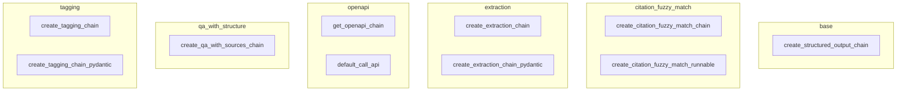

# openai_function_tool_chains
This module provides various LangChain chains for OpenAI function calling, enabling structured output, citation matching, information extraction, API interaction, and question answering with sources.

<!-- DIAGRAM_JSON
{
  "nodes": [
    {"id": "create_structured_output_chain", "label": "create_structured_output_chain"},
    {"id": "create_citation_fuzzy_match_chain", "label": "create_citation_fuzzy_match_chain"},
    {"id": "create_citation_fuzzy_match_runnable", "label": "create_citation_fuzzy_match_runnable"},
    {"id": "create_extraction_chain", "label": "create_extraction_chain"},
    {"id": "create_extraction_chain_pydantic", "label": "create_extraction_chain_pydantic"},
    {"id": "get_openapi_chain", "label": "get_openapi_chain"},
    {"id": "default_call_api", "label": "default_call_api"},
    {"id": "create_qa_with_sources_chain", "label": "create_qa_with_sources_chain"},
    {"id": "create_tagging_chain", "label": "create_tagging_chain"},
    {"id": "create_tagging_chain_pydantic", "label": "create_tagging_chain_pydantic"}
  ],
  "edges": [],
  "groups": [
    {"id": "base", "label": "base", "nodes": ["create_structured_output_chain"]},
    {"id": "citation_fuzzy_match", "label": "citation_fuzzy_match", "nodes": ["create_citation_fuzzy_match_chain", "create_citation_fuzzy_match_runnable"]},
    {"id": "extraction", "label": "extraction", "nodes": ["create_extraction_chain", "create_extraction_chain_pydantic"]},
    {"id": "openapi", "label": "openapi", "nodes": ["get_openapi_chain", "default_call_api"]},
    {"id": "qa_with_structure", "label": "qa_with_structure", "nodes": ["create_qa_with_sources_chain"]},
    {"id": "tagging", "label": "tagging", "nodes": ["create_tagging_chain", "create_tagging_chain_pydantic"]}
  ]
}
-->
