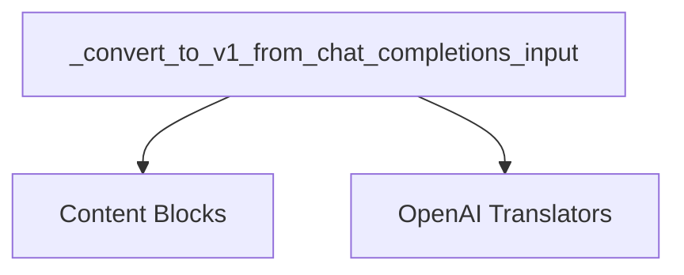

# openai_input_conversion

The `openai_input_conversion` module is a crucial component within the `core_messages` package, specifically designed to standardize the conversion of content blocks originating from OpenAI Chat Completions API inputs into a unified v1 `ContentBlock` format. This module ensures seamless interoperability and consistent message processing across various LangChain components, enabling a single, coherent message structure regardless of the original API source.

## Purpose and Core Functionality

The primary objective of this module is to normalize message structures received from OpenAI's Chat Completions API. During the initial parsing of content blocks, elements that do not conform to the standard v1 `ContentBlock` structure may be encapsulated within `'non_standard'` blocks. The core functionality, embodied in the `_convert_to_v1_from_chat_completions_input` function, is to intelligently unpack these "non-standard" wrappers. It then attempts to convert any underlying OpenAI-specific content—such as image URLs, audio inputs, or file references—into their respective v1 `ContentBlock` equivalents.

The `_convert_to_v1_from_chat_completions_input` function processes a list of content blocks, identifying potential OpenAI-formatted blocks. It applies a conversion logic, and if successful, the block is standardized. If conversion fails or if the block is already a known v1 type, it is either passed through directly or retained as a "non-standard" block, preserving its original structure for alternative handling or inspection.

## Architecture and Component Relationships

The `openai_input_conversion` module is a sub-module nested under `openai_translators`, which itself is part of the broader `core_messages` module. It relies on the `content_blocks` module for the definitions of `ContentBlock` types and associated utility functions necessary for its conversion processes. It also operates within the context of its parent `openai_translators` module, potentially utilizing other helper functions defined therein for OpenAI-specific block identification and conversion.

<!-- DIAGRAM_JSON
{
    "direction": "TD",
    "nodes": [
        {"id": "convert_openai_input", "label": "_convert_to_v1_from_chat_completions_input", "type": "component", "link": null},
        {"id": "openai_translators", "label": "OpenAI Translators", "type": "external", "link": "openai_translators.md"},
        {"id": "content_blocks", "label": "Content Blocks", "type": "external", "link": "content_blocks.md"}
    ],
    "edges": [
        {"source": "convert_openai_input", "target": "content_blocks"},
        {"source": "convert_openai_input", "target": "openai_translators"}
    ],
    "groups": []
}
-->
