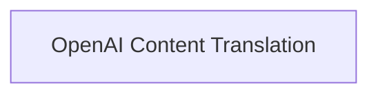

# OpenAI Message Translation Module

The `openai_message_translation` module is responsible for translating OpenAI-specific message content and message chunks into a standardized format of content blocks. This module ensures interoperability by converting diverse OpenAI message structures into a consistent representation within the larger system.

## Architecture Overview

This module primarily consists of a single sub-module that handles the core translation logic.

<!-- DIAGRAM_JSON
{
    "direction": "TD",
    "nodes": [
        {"id": "openai_content_translation", "label": "OpenAI Content Translation", "type": "module", "link": "openai_content_translation.md"}
    ],
    "edges": []
}
-->

## Sub-modules

### [OpenAI Content Translation](openai_content_translation.md)

This sub-module (`openai_content_translation`) contains the core logic for translating various OpenAI message types, including full messages and message chunks, into the system's standard content block format. It abstracts away the nuances of different OpenAI content representations, providing a unified interface for downstream components.
