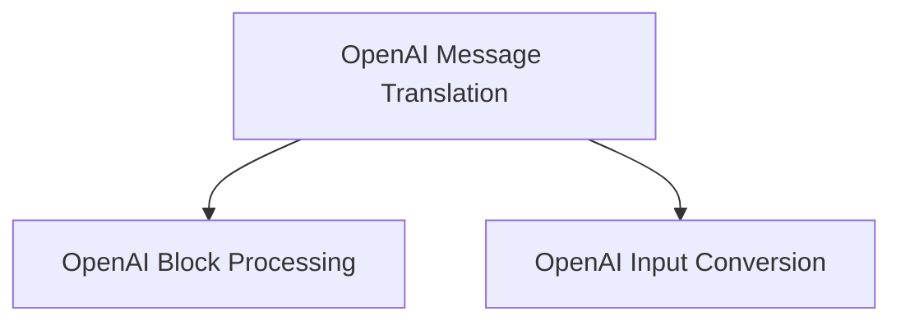

# OpenAI Translators Module Documentation

The `openai_translators` module is a core component within the `messages.block_translators` package, specifically designed to handle the translation of OpenAI-specific message and content block formats into a standardized internal representation. This module ensures interoperability and consistent processing of content originating from OpenAI's APIs.

## Purpose and Core Functionality

The primary purpose of this module is to abstract away the nuances of OpenAI's content structures, providing a uniform way to process and manipulate message content. It handles both complete AI messages and message chunks, converting them into a list of generic `ContentBlock` objects. This standardization is crucial for integrating OpenAI outputs with other parts of the system that expect a consistent content block format.

## Architecture Overview

The `openai_translators` module is composed of several key sub-modules, each responsible for a specific aspect of the translation process. The overall architecture focuses on efficient and accurate conversion of diverse OpenAI content types into a unified format.

<!-- DIAGRAM_JSON
{
    "direction": "TD",
    "nodes": [
        {"id": "openai_message_translation", "label": "OpenAI Message Translation", "type": "module", "link": "openai_message_translation.md"},
        {"id": "openai_block_processing", "label": "OpenAI Block Processing", "type": "module", "link": "openai_block_processing.md"},
        {"id": "openai_input_conversion", "label": "OpenAI Input Conversion", "type": "module", "link": "openai_input_conversion.md"}
    ],
    "edges": [
        {"source": "openai_message_translation", "target": "openai_block_processing"},
        {"source": "openai_message_translation", "target": "openai_input_conversion"}
    ],
    "groups": []
}
-->

## High-Level Functionality of Sub-modules

### [OpenAI Message Translation](openai_message_translation.md)
This sub-module is responsible for the initial translation of full `AIMessage` objects and `AIMessageChunk` objects from OpenAI into standardized content blocks. It serves as the entry point for OpenAI content into the system's generic message processing pipeline.

### [OpenAI Block Processing](openai_block_processing.md)
This sub-module handles the detailed iteration and conversion of various raw content block types found within OpenAI messages. It processes elements such as text, reasoning, image generation calls, function calls, web search results, file search results, code interpreter outputs, and multi-cloud platform (MCP) interactions, ensuring each is correctly transformed into a standard `ContentBlock`.

### [OpenAI Input Conversion](openai_input_conversion.md)
This sub-module focuses on converting OpenAI Chat Completions input format blocks to the v1 content block format. It intelligently unpacks "non_standard" blocks that may have originated from OpenAI-specific formats, attempting to convert them into recognized v1 `ContentBlock` types to maintain data consistency.