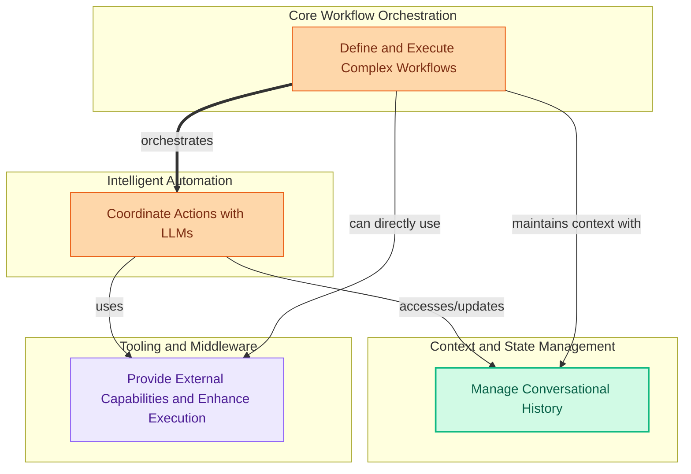

The `orchestration_and_agents` module provides the core framework for building sophisticated AI applications by enabling intelligent agents to interact with language models and external tools, structuring complex workflows through chains, and managing conversational state with various memory implementations. It empowers users to create dynamic, context-aware, and capable AI systems.

### How it Works

The module's components work together to enable intelligent decision-making, structured execution, and persistent conversational context:

1.  **Intelligent Automation (`agents_mod`)**: Agents are the decision-making core, using Language Models (LLMs) to determine which actions to take. They interpret user requests, decide which tools to use, and formulate responses.
2.  **Core Workflow Orchestration (`chains_mod`)**: Chains provide a structured way to combine LLMs, agents, and other components into multi-step workflows. They define the sequence of operations, allowing for complex, multi-turn interactions and data processing.
3.  **Context and State Management (`memory_mod`)**: Memory components enable agents and chains to retain information across turns, providing conversational context. This includes various strategies like buffering, summarization, and entity tracking to ensure coherent and relevant interactions.
4.  **Tooling and Middleware (`tools_mod`)**: Tools extend the capabilities of agents by allowing them to interact with external systems (e.g., search engines, databases, APIs). Middleware enhances the execution flow by adding functionalities like input/output processing, error handling, and security measures.

Together, these components form a powerful system where intelligent agents can reason, act, remember, and interact with the world, all orchestrated through flexible and extensible chains.

### Core Components Documentation

*   **Agents**: [agents.md](agents.md)
*   **Chains**: [chains.md](chains.md)
*   **Memory**: [memory.md](memory.md)
*   **Tools and Middleware**: [tools_and_middleware.md](tools_and_middleware.md)