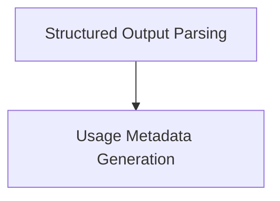

# Output and Usage Handling Module

This module is responsible for processing and interpreting outputs from OpenAI chat models, including parsing structured responses and generating detailed token usage metadata. It ensures that model responses are correctly handled, whether they contain structured data, refusal messages, or require usage tracking.

## Architecture

The `output_and_usage_handling` module is composed of two primary sub-modules:

<!-- DIAGRAM_JSON
{
    "direction": "TD",
    "nodes": [
        {"id": "structured_output_parsing", "label": "Structured Output Parsing", "type": "module", "link": "structured_output_parsing.md"},
        {"id": "usage_metadata_generation", "label": "Usage Metadata Generation", "type": "module", "link": "usage_metadata_generation.md"}
    ],
    "edges": [
        {"source": "structured_output_parsing", "target": "usage_metadata_generation"}
    ],
    "groups": []
}
-->

## Sub-modules

### [Structured Output Parsing](structured_output_parsing.md)
This sub-module focuses on interpreting the `AIMessage` objects received from OpenAI models. It extracts structured data according to a provided Pydantic schema or identifies refusal messages, ensuring that the application can correctly process or react to the model's response.

### [Usage Metadata Generation](usage_metadata_generation.md)
This sub-module is responsible for transforming the raw token usage information provided by OpenAI into a standardized `UsageMetadata` object. It calculates input, output, and total token counts, and incorporates service-tier specific details for comprehensive usage tracking and reporting.
