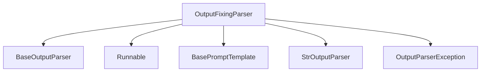

# Output_Fixing_Parser Module Documentation

## Introduction

The `output_fixing_parser` module provides a robust mechanism to enhance the reliability of output parsing in applications. It wraps an existing output parser and attempts to fix any parsing errors that occur by leveraging a language model (LLM) to re-process the completion. This ensures that even if the initial output from an LLM is malformed, the system can attempt to correct it, thereby increasing the overall resilience of the parsing pipeline.

## Core Functionality

The central component of this module is the `OutputFixingParser` class.

### `OutputFixingParser` Class

```python
class OutputFixingParser(BaseOutputParser[T]):
    # ... (simplified for documentation)
```

The `OutputFixingParser` acts as a wrapper around another `BaseOutputParser`. When the wrapped parser fails to parse a given completion, `OutputFixingParser` utilizes a `retry_chain` (typically an LLM) to generate a corrected completion based on the original completion and the parsing error. This process can be retried a specified number of times.

**Key Attributes:**

*   `parser`: An instance of `BaseOutputParser` that the `OutputFixingParser` attempts to use first. If this parser fails, the fixing mechanism is invoked.
*   `retry_chain`: A `RunnableSerializable` (or an `LLMChain` in legacy contexts) responsible for generating a corrected completion when parsing fails. This chain typically takes the parsing instructions, the original completion, and the error message as input.
*   `max_retries`: An integer specifying the maximum number of times the `OutputFixingParser` will attempt to fix and re-parse the completion before giving up and raising an `OutputParserException`.
*   `legacy`: A boolean flag indicating whether to use legacy `run`/`arun` methods or modern `invoke`/`ainvoke` methods for the `retry_chain`.

**Methods:**

*   `from_llm(cls, llm: Runnable, parser: BaseOutputParser[T], prompt: BasePromptTemplate, max_retries: int) -> OutputFixingParser[T]`:
    A class method that provides a convenient way to instantiate `OutputFixingParser`. It takes an `llm`, the `parser` to be wrapped, a `prompt` for the fixing LLM, and `max_retries`. It constructs a `retry_chain` using the provided `llm` and `prompt`.

*   `parse(self, completion: str) -> T`:
    Attempts to parse the `completion` using the wrapped `parser`. If an `OutputParserException` occurs, it invokes the `retry_chain` to get a corrected `completion` and retries the parsing process up to `max_retries` times.

*   `aparse(self, completion: str) -> T`:
    The asynchronous version of the `parse` method, offering the same retry logic for asynchronous parsing operations.

*   `get_format_instructions(self) -> str`:
    Delegates to the wrapped `parser` to retrieve its format instructions.

## Architecture and Component Relationships

The `output_fixing_parser` module integrates with various core components to achieve its functionality. It primarily depends on the `core_output_parsers` for its base parsing capabilities and `core_runnables` and `core_prompts` for constructing the retry mechanism.

<!-- DIAGRAM_JSON
{
    "direction": "TD",
    "nodes": [
        {"id": "output_fixing_parser_component", "label": "OutputFixingParser", "type": "component", "link": null},
        {"id": "base_output_parser_ext", "label": "BaseOutputParser", "type": "external", "link": "base_parsers.md"},
        {"id": "runnable_ext", "label": "Runnable", "type": "external", "link": "core_runnables.md"},
        {"id": "base_prompt_template_ext", "label": "BasePromptTemplate", "type": "external", "link": "core_prompts.md"},
        {"id": "str_output_parser_ext", "label": "StrOutputParser", "type": "external", "link": "core_output_parsers.md"},
        {"id": "output_parser_exception_ext", "label": "OutputParserException", "type": "external", "link": "base_parsers.md"}
    ],
    "edges": [
        {"source": "output_fixing_parser_component", "target": "base_output_parser_ext"},
        {"source": "output_fixing_parser_component", "target": "runnable_ext"},
        {"source": "output_fixing_parser_component", "target": "base_prompt_template_ext"},
        {"source": "output_fixing_parser_component", "target": "str_output_parser_ext"},
        {"source": "output_fixing_parser_component", "target": "output_parser_exception_ext"}
    ],
    "groups": []
}
-->



## How the Module Fits into the Overall System

The `output_fixing_parser` module serves as an essential utility within the larger system, particularly in scenarios where reliable parsing of LLM outputs is critical. It acts as an intermediary, enhancing the robustness of any `BaseOutputParser` by providing an automatic error correction mechanism. This is especially useful in agentic workflows, chain executions, or any application where the output format from an LLM might occasionally deviate from the expected structure. By intelligently attempting to repair malformed outputs, it reduces the need for manual intervention or fragile error handling logic downstream, contributing to a more stable and resilient application.