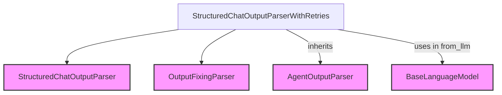

# Module: output_parsing

The `output_parsing` module provides robust output parsing capabilities for structured chat agents, specifically focusing on handling and retrying parsing failures. It plays a crucial role in ensuring that the output from language models adheres to expected formats, enabling reliable operation of agents that depend on structured responses.

## Core Functionality

The primary component of this module is `StructuredChatOutputParserWithRetries`, which extends the basic output parsing functionality with a retry mechanism. This is particularly useful in scenarios where the language model might occasionally produce malformed output, allowing the system to attempt to fix it using an `OutputFixingParser`.

## Architecture and Component Relationships

<!-- DIAGRAM_JSON
{
    "direction": "TD",
    "nodes": [
        {"id": "structured_chat_output_parser_with_retries", "label": "StructuredChatOutputParserWithRetries", "type": "component", "link": null},
        {"id": "structured_chat_output_parser", "label": "StructuredChatOutputParser", "type": "external", "link": "structured_chat_core.md"},
        {"id": "output_fixing_parser", "label": "OutputFixingParser", "type": "external", "link": "classic_output_parsers.md"},
        {"id": "base_language_model", "label": "BaseLanguageModel", "type": "external", "link": "core_language_models.md"},
        {"id": "agent_output_parser", "label": "AgentOutputParser", "type": "external", "link": "core_output_parsers.md"}
    ],
    "edges": [
        {"source": "structured_chat_output_parser_with_retries", "target": "structured_chat_output_parser"},
        {"source": "structured_chat_output_parser_with_retries", "target": "output_fixing_parser"},
        {"source": "structured_chat_output_parser_with_retries", "target": "agent_output_parser", "label": "inherits"},
        {"source": "structured_chat_output_parser_with_retries", "target": "base_language_model", "label": "uses in from_llm"}
    ],
    "groups": []
}
-->

## Module Components

### StructuredChatOutputParserWithRetries

`StructuredChatOutputParserWithRetries` is a specialized output parser designed for structured chat agents. It provides a robust mechanism to parse language model outputs, with an added layer of error handling and retry capabilities.

**Key Features:**

*   **Retry Mechanism:** It attempts to parse the output using a `base_parser` (typically `StructuredChatOutputParser`). If parsing fails, and an `output_fixing_parser` is provided, it leverages this parser to attempt to correct and re-parse the malformed output.
*   **Flexible Initialization:** Can be initialized directly or created from a `BaseLanguageModel` using the `from_llm` class method. When initialized with an `llm`, it automatically sets up an `OutputFixingParser`.
*   **Integration with Agents:** Inherits from `AgentOutputParser`, making it compatible with Langchain's agent framework.

**Relationships:**

*   **Inherits from:** `AgentOutputParser` ([core_output_parsers.md](core_output_parsers.md)) - Provides the foundational interface for agent output parsing.
*   **Uses:**
    *   `StructuredChatOutputParser` (part of [structured_chat_core.md](structured_chat_core.md)) - The primary parser used for structured chat agent outputs.
    *   `OutputFixingParser` ([classic_output_parsers.md](classic_output_parsers.md)) - Used to attempt to correct and re-parse outputs that initially fail parsing.
    *   `BaseLanguageModel` ([core_language_models.md](core_language_models.md)) - Used in the `from_llm` factory method to create an `OutputFixingParser`.

## How the Module Fits into the Overall System

The `output_parsing` module, specifically `StructuredChatOutputParserWithRetries`, is a critical component within the `structured_chat_core` module, which is part of the broader `classic_agents` system. It ensures the reliability and robustness of structured chat agents by gracefully handling and attempting to correct parsing errors in language model outputs.

It acts as an intermediary between the raw output of a language model and the agent's decision-making process. By providing a reliable way to interpret structured responses, it enables agents to consistently understand and act upon the information generated by the LLM, even in the presence of minor formatting inconsistencies. This module enhances the overall fault tolerance and user experience of agent-based applications.