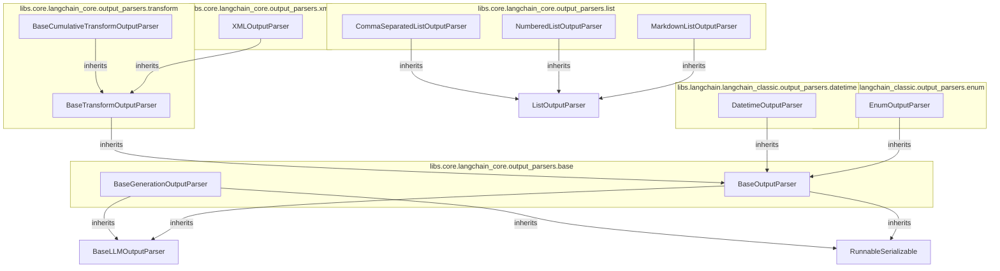

# output_parsing
This module provides a suite of output parsers designed to structure and transform language model responses into various formats, including lists, XML, datetimes, and enums.

<!-- DIAGRAM_JSON
{
  "nodes": [
    {
      "id": "id_1",
      "label": "BaseGenerationOutputParser",
      "metadata": {
        "filepath": "libs/core/langchain_core/output_parsers/base/BaseGenerationOutputParser.py"
      }
    },
    {
      "id": "id_2",
      "label": "BaseOutputParser",
      "metadata": {
        "filepath": "libs/core/langchain_core/output_parsers/base/BaseOutputParser.py"
      }
    },
    {
      "id": "id_3",
      "label": "CommaSeparatedListOutputParser",
      "metadata": {
        "filepath": "libs/core/langchain_core/output_parsers/list/CommaSeparatedListOutputParser.py"
      }
    },
    {
      "id": "id_4",
      "label": "NumberedListOutputParser",
      "metadata": {
        "filepath": "libs/core/langchain_core/output_parsers/list/NumberedListOutputParser.py"
      }
    },
    {
      "id": "id_5",
      "label": "MarkdownListOutputParser",
      "metadata": {
        "filepath": "libs/core/langchain_core/output_parsers/list/MarkdownListOutputParser.py"
      }
    },
    {
      "id": "id_6",
      "label": "BaseCumulativeTransformOutputParser",
      "metadata": {
        "filepath": "libs/core/langchain_core/output_parsers/transform/BaseCumulativeTransformOutputParser.py"
      }
    },
    {
      "id": "id_7",
      "label": "BaseTransformOutputParser",
      "metadata": {
        "filepath": "libs/core/langchain_core/output_parsers/transform/BaseTransformOutputParser.py"
      }
    },
    {
      "id": "id_8",
      "label": "XMLOutputParser",
      "metadata": {
        "filepath": "libs/core/langchain_core/output_parsers/xml/XMLOutputParser.py"
      }
    },
    {
      "id": "id_9",
      "label": "DatetimeOutputParser",
      "metadata": {
        "filepath": "libs/langchain/langchain_classic/output_parsers/datetime/DatetimeOutputParser.py"
      }
    },
    {
      "id": "id_10",
      "label": "EnumOutputParser",
      "metadata": {
        "filepath": "libs/langchain/langchain_classic/output_parsers/enum/EnumOutputParser.py"
      }
    },
    {
      "id": "id_11",
      "label": "BaseLLMOutputParser",
      "metadata": {
        "filepath": null
      }
    },
    {
      "id": "id_12",
      "label": "RunnableSerializable",
      "metadata": {
        "filepath": null
      }
    },
    {
      "id": "id_13",
      "label": "ListOutputParser",
      "metadata": {
        "filepath": null
      }
    }
  ],
  "edges": [
    {
      "source": "id_1",
      "target": "id_11",
      "type": "inherits"
    },
    {
      "source": "id_1",
      "target": "id_12",
      "type": "inherits"
    },
    {
      "source": "id_2",
      "target": "id_11",
      "type": "inherits"
    },
    {
      "source": "id_2",
      "target": "id_12",
      "type": "inherits"
    },
    {
      "source": "id_3",
      "target": "id_13",
      "type": "inherits"
    },
    {
      "source": "id_4",
      "target": "id_13",
      "type": "inherits"
    },
    {
      "source": "id_5",
      "target": "id_13",
      "type": "inherits"
    },
    {
      "source": "id_6",
      "target": "id_7",
      "type": "inherits"
    },
    {
      "source": "id_7",
      "target": "id_2",
      "type": "inherits"
    },
    {
      "source": "id_8",
      "target": "id_7",
      "type": "inherits"
    },
    {
      "source": "id_9",
      "target": "id_2",
      "type": "inherits"
    },
    {
      "source": "id_10",
      "target": "id_2",
      "type": "inherits"
    }
  ],
  "groups": [
    {
      "id": "grp_1",
      "label": "libs.core.langchain_core.output_parsers.base",
      "node_ids": [
        "id_1",
        "id_2"
      ]
    },
    {
      "id": "grp_2",
      "label": "libs.core.langchain_core.output_parsers.list",
      "node_ids": [
        "id_3",
        "id_4",
        "id_5"
      ]
    },
    {
      "id": "grp_3",
      "label": "libs.core.langchain_core.output_parsers.transform",
      "node_ids": [
        "id_6",
        "id_7"
      ]
    },
    {
      "id": "grp_4",
      "label": "libs.core.langchain_core.output_parsers.xml",
      "node_ids": [
        "id_8"
      ]
    },
    {
      "id": "grp_5",
      "label": "libs.langchain.langchain_classic.output_parsers.datetime",
      "node_ids": [
        "id_9"
      ]
    },
    {
      "id": "grp_6",
      "label": "libs.langchain.langchain_classic.output_parsers.enum",
      "node_ids": [
        "id_10"
      ]
    }
  ]
}
-->
