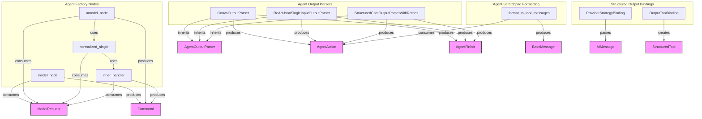

# output_processing
This module provides various components for processing agent outputs, including parsers for different agent types, utilities for formatting intermediate steps into tool messages, and bindings for structured output generation. It also includes core nodes for handling synchronous and asynchronous model requests within an agent factory.

<!-- DIAGRAM_JSON
{
  "nodes": [
    {"id": "C1", "label": "ConvoOutputParser"},
    {"id": "C2", "label": "ReActJsonSingleInputOutputParser"},
    {"id": "C3", "label": "StructuredChatOutputParserWithRetries"},
    {"id": "F1", "label": "format_to_tool_messages"},
    {"id": "B1", "label": "OutputToolBinding"},
    {"id": "B2", "label": "ProviderStrategyBinding"},
    {"id": "N1", "label": "model_node"},
    {"id": "N2", "label": "amodel_node"},
    {"id": "N3", "label": "normalized_single"},
    {"id": "N4", "label": "inner_handler"},
    {"id": "E1", "label": "AgentOutputParser", "type": "external"},
    {"id": "E2", "label": "AgentAction", "type": "external"},
    {"id": "E3", "label": "AgentFinish", "type": "external"},
    {"id": "E4", "label": "BaseMessage", "type": "external"},
    {"id": "E5", "label": "AIMessage", "type": "external"},
    {"id": "E6", "label": "StructuredTool", "type": "external"},
    {"id": "E7", "label": "ModelRequest", "type": "external"},
    {"id": "E8", "label": "Command", "type": "external"}
  ],
  "edges": [
    {"source": "C1", "target": "E1", "label": "inherits"},
    {"source": "C2", "target": "E1", "label": "inherits"},
    {"source": "C3", "target": "E1", "label": "inherits"},
    {"source": "C1", "target": "E2", "label": "produces"},
    {"source": "C1", "target": "E3", "label": "produces"},
    {"source": "C2", "target": "E2", "label": "produces"},
    {"source": "C2", "target": "E3", "label": "produces"},
    {"source": "C3", "target": "E2", "label": "produces"},
    {"source": "C3", "target": "E3", "label": "produces"},
    {"source": "F1", "target": "E2", "label": "consumes"},
    {"source": "F1", "target": "E4", "label": "produces"},
    {"source": "B1", "target": "E6", "label": "creates"},
    {"source": "B2", "target": "E5", "label": "parses"},
    {"source": "N1", "target": "E7", "label": "consumes"},
    {"source": "N1", "target": "E8", "label": "produces"},
    {"source": "N2", "target": "E7", "label": "consumes"},
    {"source": "N2", "target": "E8", "label": "produces"},
    {"source": "N3", "target": "E7", "label": "consumes"},
    {"source": "N4", "target": "E7", "label": "consumes"},
    {"source": "N4", "target": "E8", "label": "produces"},
    {"source": "N2", "target": "N3", "label": "uses"},
    {"source": "N3", "target": "N4", "label": "uses"}
  ],
  "groups": [
    {"id": "G1", "label": "Agent Output Parsers", "nodes": ["C1", "C2", "C3"]},
    {"id": "G2", "label": "Agent Scratchpad Formatting", "nodes": ["F1"]},
    {"id": "G3", "label": "Structured Output Bindings", "nodes": ["B1", "B2"]},
    {"id": "G4", "label": "Agent Factory Nodes", "nodes": ["N1", "N2", "N3", "N4"]}
  ]
}
-->
