The `langchain` repository provides a comprehensive framework for developing applications powered by large language models (LLMs). It empowers developers to move beyond simple API calls to build complex, stateful, and intelligent applications by orchestrating LLMs with external data sources, computational tools, and memory.

Users primarily interact with LangChain to:

1.  **Build Intelligent Applications:** Define multi-step workflows using "Chains" and "Agents" that can reason, act, and interact with their environment. This includes managing conversational memory and integrating various tools.
2.  **Interact with Language Models:** Select and configure different LLMs, design effective prompts, and parse the structured or unstructured outputs from these models.
3.  **Manage Data and Integrations:** Load, process, and store documents, create vector embeddings for efficient retrieval, and connect to a wide array of third-party services and data providers.
4.  **Observe and Evaluate Applications:** Monitor the execution flow of their LLM applications, trace interactions, evaluate performance, and utilize developer tools for debugging and optimization.

The repository is structured to support these workflows, offering modular components that can be easily combined and extended.

<!-- DIAGRAM_JSON
{
    "direction": "LR",
    "nodes": [
        {
            "id": "app_orchestration",
            "label": "app_orchestration",
            "type": "component"
        },
        {
            "id": "caching_and_storage",
            "label": "Cache Responses & Data",
            "type": "module",
            "link": "caching_and_storage.md"
        },
        {
            "id": "callbacks_and_tracing",
            "label": "Monitor & Trace Runs",
            "type": "module",
            "link": "callbacks_and_tracing.md"
        },
        {
            "id": "developer_tools",
            "label": "Utilize Developer Tools",
            "type": "module",
            "link": "developer_tools.md"
        },
        {
            "id": "document_management",
            "label": "Load, Split & Index Documents",
            "type": "module",
            "link": "document_management.md"
        },
        {
            "id": "evaluation_framework",
            "label": "Evaluate Application Performance",
            "type": "module",
            "link": "evaluation_framework.md"
        },
        {
            "id": "language_model_interface",
            "label": "Interact with Language Models",
            "type": "module",
            "link": "language_model_interface.md"
        },
        {
            "id": "llm_interaction",
            "label": "llm_interaction",
            "type": "component"
        },
        {
            "id": "memory",
            "label": "Manage Conversational Memory",
            "type": "module",
            "link": "memory.md"
        },
        {
            "id": "orchestration_and_agents",
            "label": "Orchestrate Agents & Chains",
            "type": "module",
            "link": "orchestration_and_agents.md"
        },
        {
            "id": "output_parsing",
            "label": "Parse Model Outputs",
            "type": "module",
            "link": "output_parsing.md"
        },
        {
            "id": "partner_integrations",
            "label": "Connect to Partner Services",
            "type": "module",
            "link": "partner_integrations.md"
        },
        {
            "id": "prompts_and_examples",
            "label": "Design Prompts & Examples",
            "type": "module",
            "link": "prompts_and_examples.md"
        },
        {
            "id": "retrieval_systems",
            "label": "Retrieve Relevant Information",
            "type": "module",
            "link": "retrieval_systems.md"
        },
        {
            "id": "tools_and_middleware",
            "label": "Define Tools & Middleware",
            "type": "module",
            "link": "tools_and_middleware.md"
        },
        {
            "id": "user",
            "label": "Developer",
            "type": "component"
        },
        {
            "id": "vector_stores",
            "label": "Store & Search Embeddings",
            "type": "module",
            "link": "vector_stores.md"
        }
    ],
    "edges": [
        {
            "source": "user",
            "target": "orchestration_and_agents",
            "label": "builds applications"
        },
        {
            "source": "user",
            "target": "language_model_interface",
            "label": "configures LLMs directly"
        },
        {
            "source": "orchestration_and_agents",
            "target": "language_model_interface",
            "label": "uses"
        },
        {
            "source": "orchestration_and_agents",
            "target": "memory",
            "label": "manages state with"
        },
        {
            "source": "orchestration_and_agents",
            "target": "tools_and_middleware",
            "label": "invokes"
        },
        {
            "source": "orchestration_and_agents",
            "target": "retrieval_systems",
            "label": "integrates data from"
        },
        {
            "source": "language_model_interface",
            "target": "prompts_and_examples",
            "label": "formats inputs with"
        },
        {
            "source": "language_model_interface",
            "target": "output_parsing",
            "label": "structures outputs with"
        },
        {
            "source": "retrieval_systems",
            "target": "vector_stores",
            "label": "queries"
        },
        {
            "source": "document_management",
            "target": "vector_stores",
            "label": "indexes into"
        },
        {
            "source": "document_management",
            "target": "retrieval_systems",
            "label": "prepares data for"
        },
        {
            "source": "partner_integrations",
            "target": "language_model_interface",
            "label": "provides LLM implementations"
        },
        {
            "source": "partner_integrations",
            "target": "document_management",
            "label": "offers data loaders"
        },
        {
            "source": "partner_integrations",
            "target": "tools_and_middleware",
            "label": "provides specialized tools"
        },
        {
            "source": "callbacks_and_tracing",
            "target": "orchestration_and_agents",
            "label": "observes"
        },
        {
            "source": "callbacks_and_tracing",
            "target": "language_model_interface",
            "label": "observes"
        },
        {
            "source": "evaluation_framework",
            "target": "callbacks_and_tracing",
            "label": "analyzes traces from"
        },
        {
            "source": "caching_and_storage",
            "target": "language_model_interface",
            "label": "optimizes calls to"
        },
        {
            "source": "developer_tools",
            "target": "evaluation_framework",
            "label": "supports"
        }
    ],
    "groups": [
        {
            "id": "app_orchestration__group",
            "label": "Application Development & Orchestration",
            "nodes": [
                "orchestration_and_agents",
                "memory",
                "tools_and_middleware"
            ],
            "_repaired": "r4_group_renamed_avoid_node_collision"
        },
        {
            "id": "llm_interaction__group",
            "label": "Language Model Interaction",
            "nodes": [
                "language_model_interface",
                "prompts_and_examples",
                "output_parsing"
            ],
            "_repaired": "r4_group_renamed_avoid_node_collision"
        },
        {
            "id": "data_integrations",
            "label": "Data Management & Integrations",
            "nodes": [
                "document_management",
                "retrieval_systems",
                "vector_stores",
                "partner_integrations"
            ]
        },
        {
            "id": "observability_utilities",
            "label": "Observability & Utilities",
            "nodes": [
                "callbacks_and_tracing",
                "evaluation_framework",
                "caching_and_storage",
                "developer_tools"
            ]
        }
    ],
    "_auto_generated": "r1_overview_synthesis"
}
-->

```mermaid
flowchart LR
    user(("Developer"))
    user ==>|"builds applications"| app_orchestration
    user -->|"configures LLMs directly"| llm_interaction

    subgraph app_orchestration["Application Development & Orchestration"]
        orchestration_and_agents["Orchestrate Agents & Chains"]
        memory["Manage Conversational Memory"]
        tools_and_middleware["Define Tools & Middleware"]
    end

    subgraph llm_interaction["Language Model Interaction"]
        language_model_interface["Interact with Language Models"]
        prompts_and_examples["Design Prompts & Examples"]
        output_parsing["Parse Model Outputs"]
    end

    subgraph data_integrations["Data Management & Integrations"]
        document_management["Load, Split & Index Documents"]
        retrieval_systems["Retrieve Relevant Information"]
        vector_stores["Store & Search Embeddings"]
        partner_integrations["Connect to Partner Services"]
    end

    subgraph observability_utilities["Observability & Utilities"]
        callbacks_and_tracing["Monitor & Trace Runs"]
        evaluation_framework["Evaluate Application Performance"]
        caching_and_storage["Cache Responses & Data"]
        developer_tools["Utilize Developer Tools"]
    end

    %% Connections
    orchestration_and_agents ==>|"uses"| language_model_interface
    orchestration_and_agents -->|"manages state with"| memory
    orchestration_and_agents -->|"invokes"| tools_and_middleware
    orchestration_and_agents -->|"integrates data from"| retrieval_systems

    language_model_interface -->|"formats inputs with"| prompts_and_examples
    language_model_interface -->|"structures outputs with"| output_parsing

    retrieval_systems -->|"queries"| vector_stores
    document_management -->|"indexes into"| vector_stores
    document_management -->|"prepares data for"| retrieval_systems

    partner_integrations -->|"provides LLM implementations"| language_model_interface
    partner_integrations -->|"offers data loaders"| document_management
    partner_integrations -->|"provides specialized tools"| tools_and_middleware

    callbacks_and_tracing -.->|"observes"| orchestration_and_agents
    callbacks_and_tracing -.->|"observes"| language_model_interface
    evaluation_framework -.->|"analyzes traces from"| callbacks_and_tracing
    caching_and_storage -.->|"optimizes calls to"| language_model_interface
    developer_tools -.->|"supports"| evaluation_framework

    %% Styling
    classDef userNode fill:#fef3c7,stroke:#d97706,stroke-width:2px,color:#92400e
    classDef surface fill:#dbeafe,stroke:#3b82f6,stroke-width:2px,color:#1e3a5f
    classDef data fill:#d1fae5,stroke:#10b981,stroke-width:2px,color:#065f46
    classDef generative fill:#fed7aa,stroke:#ea580c,stroke-width:1px,color:#7c2d12
    classDef analytical fill:#ede9fe,stroke:#8b5cf6,stroke-width:1px,color:#4c1d95

    class user userNode
    class orchestration_and_agents generative
    class memory data
    class tools_and_middleware analytical
    class language_model_interface generative
    class prompts_and_examples analytical
    class output_parsing analytical
    class document_management data
    class retrieval_systems analytical
    class vector_stores data
    class partner_integrations surface
    class callbacks_and_tracing analytical
    class evaluation_framework analytical
    class caching_and_storage data
    class developer_tools analytical

    %% Clickable links
    click orchestration_and_agents "orchestration_and_agents.md" "View Orchestration & Agents"
    click memory "memory.md" "View Memory Management"
    click tools_and_middleware "tools_and_middleware.md" "View Tools & Middleware"
    click language_model_interface "language_model_interface.md" "View Language Model Interface"
    click prompts_and_examples "prompts_and_examples.md" "View Prompts & Examples"
    click output_parsing "output_parsing.md" "View Output Parsing"
    click document_management "document_management.md" "View Document Management"
    click retrieval_systems "retrieval_systems.md" "View Retrieval Systems"
    click vector_stores "vector_stores.md" "View Vector Stores"
    click partner_integrations "partner_integrations.md" "View Partner Integrations"
    click callbacks_and_tracing "callbacks_and_tracing.md" "View Callbacks & Tracing"
    click evaluation_framework "evaluation_framework.md" "View Evaluation Framework"
    click caching_and_storage "caching_and_storage.md" "View Caching & Storage"
    click developer_tools "developer_tools.md" "View Developer Tools"
```

