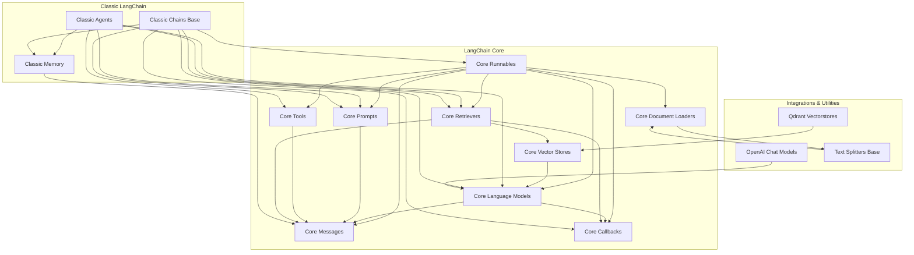

The `langchain-src` repository serves as the foundational codebase for the LangChain ecosystem, providing core abstractions, classic components, and partner integrations essential for building sophisticated large language model (LLM) applications. It encompasses fundamental interfaces for language models, prompts, tools, and runnables, alongside higher-level frameworks for agents and chains, and a wide array of integrations with third-party services and text processing utilities. Its purpose is to offer a modular, extensible, and robust framework for developing AI-powered applications.

## Architecture Overview

The `langchain-src` repository is structured into several key areas: **LangChain Core** for fundamental abstractions, **Classic LangChain** for established higher-level components, **Partner Integrations** for external service connections, and **Text Processing Utilities** for data preparation. These areas interact to form a comprehensive framework for building LLM-powered applications.

## Main Modules

### LangChain Core
This section contains the fundamental building blocks of the LangChain framework, defining interfaces and basic implementations for key concepts:
-   **[Core Runnables](core_runnables.md)**: The foundation for the LangChain Expression Language (LCEL), enabling composable and executable units of work.
-   **[Core Language Models](core_language_models.md)**: Abstract interfaces for interacting with various LLMs and chat models.
-   **[Core Prompts](core_prompts.md)**: Tools for constructing, managing, and formatting prompts for language models.
-   **[Core Messages](core_messages.md)**: Defines the standard message types and content blocks for conversational interactions.
-   **[Core Tools](core_tools.md)**: Provides the base for defining and managing tools that agents can use to interact with external systems.
-   **[Core Retrievers](core_retrievers.md)**: Abstract base class for implementing document retrieval systems.
-   **[Core Callbacks](core_callbacks.md)**: A flexible system for handling events and interactions within the framework, enabling logging, monitoring, and tracing.
-   **[Core Vector Stores](core_vectorstores.md)**: Foundational interfaces and in-memory implementations for managing vector embeddings.
-   **[Core Document Loaders](core_document_loaders.md)**: Framework for loading various types of documents into a standardized format.

### Classic LangChain
This section includes established, higher-level components from the classic LangChain architecture:
-   **[Classic Agents](classic_agents.md)**: A comprehensive framework for building and managing intelligent agents.
-   **[Classic Chains Base](classic_chains_base.md)**: The foundational abstraction for constructing structured sequences of operations.
-   **[Classic Memory](classic_memory.md)**: A suite of conversation memory implementations for maintaining conversational context.

### Partner Integrations
This section provides integrations with various third-party services and LLM providers:
-   **[OpenAI Chat Models](partners_openai_chat_models.md)**: Core functionalities for interacting with OpenAI's chat models.
-   **[Qdrant Vectorstores](partners_qdrant_vectorstores.md)**: Robust integrations with Qdrant, a high-performance vector similarity search engine.

### Text Processing Utilities
This section offers utilities specifically designed for handling and splitting text:
-   **[Text Splitters Base](text_splitters_base.md)**: Foundational components for splitting text into manageable chunks, primarily focusing on token-based strategies.