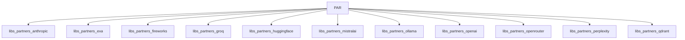

# Partner Integrations

This module contains 11 sub-modules:

- [libs_partners_anthropic](libs_partners_anthropic.md) - 10 components
- [libs_partners_exa](libs_partners_exa.md) - 3 components
- [libs_partners_fireworks](libs_partners_fireworks.md) - 1 components
- [libs_partners_groq](libs_partners_groq.md) - 4 components
- [libs_partners_huggingface](libs_partners_huggingface.md) - 2 components
- [libs_partners_mistralai](libs_partners_mistralai.md) - 1 components
- [libs_partners_ollama](libs_partners_ollama.md) - 1 components
- [libs_partners_openai](libs_partners_openai.md) - 4 components
- [libs_partners_openrouter](libs_partners_openrouter.md) - 1 components
- [libs_partners_perplexity](libs_partners_perplexity.md) - 1 components
- [libs_partners_qdrant](libs_partners_qdrant.md) - 2 components

## Architecture

