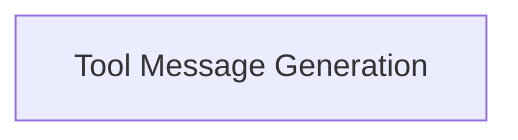

# partners_anthropic_experimental Module Documentation

## Introduction

The `partners_anthropic_experimental` module provides experimental utilities for integrating Anthropic models, specifically focusing on the generation of system messages for tool descriptions and the conversion of XML output to tool calls. This module acts as a bridge to enhance the interaction between LangChain components and Anthropic's AI capabilities, particularly in scenarios involving structured tool usage.

## Architecture Overview

The module is structured into a single sub-module that encapsulates the core logic for tool message generation and XML parsing.

<!-- DIAGRAM_JSON
{
    "direction": "TD",
    "nodes": [
        {"id": "tool_message_generation", "label": "Tool Message Generation", "type": "module", "link": "tool_message_generation.md"}
    ],
    "edges": [],
    "groups": []
}
-->

## Sub-modules

### [Tool Message Generation](tool_message_generation.md)
This sub-module is responsible for transforming tool definitions into human-readable system messages for the AI model and parsing XML responses into structured tool calls. It centralizes the logic for preparing tool-related communication with Anthropic models, ensuring proper formatting and interpretation.
