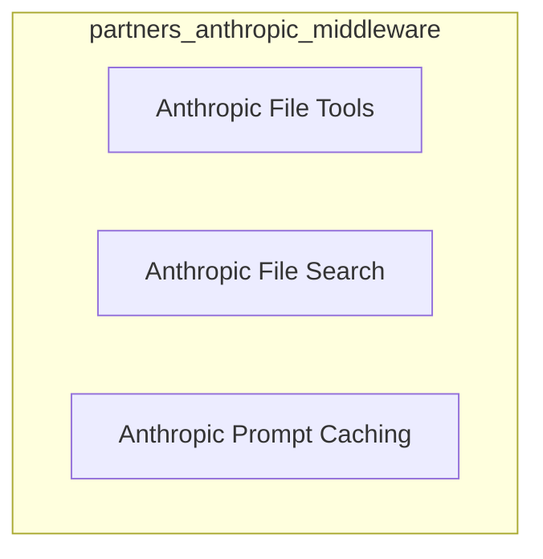

# Anthropic Middleware Module (`partners_anthropic_middleware`)

## Introduction
The `partners_anthropic_middleware` module provides a suite of middleware components designed to enhance interactions with Anthropic models. These components offer functionalities ranging from file manipulation and search using state-based or filesystem-based tools, to optimizing API usage through intelligent prompt caching. This module aims to provide robust and flexible extensions for agents interacting with Anthropic's ecosystem.

## Architecture Overview
The module is structured into several distinct sub-modules, each addressing a specific area of functionality. These middleware components are designed to be pluggable, allowing developers to easily integrate them into their agent workflows to extend capabilities or optimize performance.

<!-- DIAGRAM_JSON
{
    "direction": "TD",
    "nodes": [
        {"id": "anthropic_file_tools", "label": "Anthropic File Tools", "type": "module", "link": "anthropic_file_tools.md"},
        {"id": "anthropic_file_search", "label": "Anthropic File Search", "type": "module", "link": "anthropic_file_search.md"},
        {"id": "anthropic_prompt_caching", "label": "Anthropic Prompt Caching", "type": "module", "link": "anthropic_prompt_caching.md"}
    ],
    "edges": [],
    "groups": []
}
-->

## High-Level Functionality

### [Anthropic File Tools](anthropic_file_tools.md)
This sub-module provides middleware for integrating Anthropic's `text_editor` and `memory` tools. It supports both state-based storage (persisting for the conversation thread) and filesystem-based storage (allowing user-managed persistence), enabling agents to interact with virtual or real file systems.

### [Anthropic File Search](anthropic_file_search.md)
This sub-module offers powerful file search capabilities for state-based virtual files. It includes `Glob` for pattern matching by file path and `Grep` for content searching using regular expressions, enhancing an agent's ability to navigate and query its file environment.

### [Anthropic Prompt Caching](anthropic_prompt_caching.md)
The `anthropic_prompt_caching` sub-module is designed to optimize API usage for Anthropic models. It implements prompt caching by tagging system messages, tool definitions, and conversation prefixes with cache control directives, thereby reducing token usage and improving response times.
