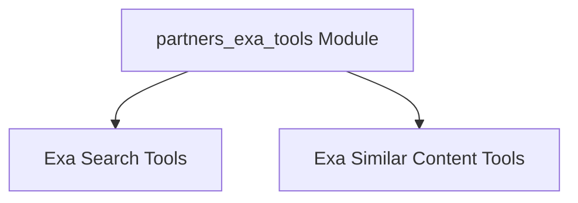

# partners_exa_tools Module Documentation

## Introduction

The `partners_exa_tools` module provides a set of tools for interacting with the Exa API, an advanced web search engine. These tools are designed to facilitate integration with AI applications, offering functionalities for performing web searches and finding similar content.

## Architecture Overview

The `partners_exa_tools` module is composed of two primary sub-modules:

- **Exa Search Tools**: Handles direct web search queries.
- **Exa Similar Content Tools**: Focuses on discovering content similar to a given URL.

The overall architecture emphasizes modularity, allowing for easy expansion and maintenance of the Exa API integration.

<!-- DIAGRAM_JSON
{
    "direction": "TD",
    "nodes": [
        {"id": "exa_search_tools", "label": "Exa Search Tools", "type": "module", "link": "exa_search_tools.md"},
        {"id": "exa_similar_tools", "label": "Exa Similar Content Tools", "type": "module", "link": "exa_similar_tools.md"}
    ],
    "edges": [
        {"source": "partners_exa_tools", "target": "exa_search_tools"},
        {"source": "partners_exa_tools", "target": "exa_similar_tools"}
    ],
    "groups": []
}
-->

## Sub-modules

- [Exa Search Tools](exa_search_tools.md): Provides tools for performing web searches using the Exa API and retrieving structured results.
- [Exa Similar Content Tools](exa_similar_tools.md): Offers tools to find similar web pages based on a given URL using the Exa API.
