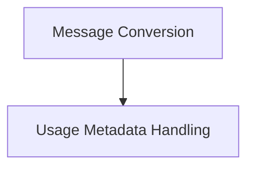

# Partners Groq Chat Models

## Introduction

The `partners_groq_chat_models` module provides the integration layer for interacting with Groq's chat models within the LangChain framework. It facilitates seamless communication by handling the conversion of messages between LangChain's internal formats and the Groq API's specific requirements, as well as processing usage metadata.

## Architecture Overview

This module is primarily responsible for ensuring compatibility and data integrity when exchanging chat messages and related information with Groq services. It abstracts away the complexities of the Groq API, allowing other LangChain components to interact with Groq models through a standardized interface. The module is composed of two main sub-modules:

1.  **Message Conversion**: Manages the bidirectional translation of chat messages.
2.  **Usage Metadata Handling**: Processes and formats token usage data from Groq responses.

<!-- DIAGRAM_JSON
{
    "direction": "TD",
    "nodes": [
        {"id": "message_conversion", "label": "Message Conversion", "type": "module", "link": "message_conversion.md"},
        {"id": "usage_metadata_handling", "label": "Usage Metadata Handling", "type": "module", "link": "usage_metadata_handling.md"}
    ],
    "edges": [
        {"source": "message_conversion", "target": "usage_metadata_handling"}
    ],
    "groups": []
}
-->

## Sub-modules

### [Message Conversion](message_conversion.md)

This sub-module is critical for the interoperability between LangChain and Groq chat models. It contains functions that convert LangChain `BaseMessage` objects into a dictionary format suitable for the Groq API and vice-versa. This includes handling various message types (Human, AI, System, Function, Tool) and managing additional arguments like function calls and tool calls, ensuring they conform to Groq's expected structure. It also handles streaming chunks from Groq and converts them into LangChain `BaseMessageChunk` objects.

### [Usage Metadata Handling](usage_metadata_handling.md)

The `usage_metadata_handling` sub-module is responsible for parsing and structuring the token usage information returned by the Groq API. It normalizes different formats of token usage (e.g., `input_tokens` vs `prompt_tokens`) and provides a consistent `UsageMetadata` object, which includes details about input, output, and total tokens, as well as specific token details like cached and reasoning tokens. This allows for standardized tracking and reporting of model usage within the LangChain ecosystem.