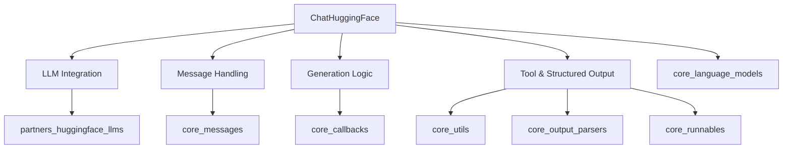

# partners_huggingface_chat_models

The `partners_huggingface_chat_models` module provides a robust interface for integrating various Hugging Face Large Language Models (LLMs) as ChatModels within the LangChain framework. It enables seamless interaction with models from `HuggingFaceTextGenInference`, `HuggingFaceEndpoint`, `HuggingFaceHub`, and `HuggingFacePipeline`, abstracting away the complexities of their underlying APIs. This module is essential for developers looking to leverage the vast ecosystem of Hugging Face models for conversational AI applications, offering capabilities such as message conversion, streaming, asynchronous operations, tool calling, and structured output generation.

### Architecture and Core Components

The core of this module is the `ChatHuggingFace` class, which extends `langchain_core.language_models.chat.BaseChatModel`. This class acts as a wrapper, adapting the functionalities of different Hugging Face LLM types to conform to the LangChain ChatModel interface.

The module manages several key functionalities:
*   **LLM Integration:** It dynamically handles the specific requirements and parameters of different Hugging Face LLM backends (Endpoint, TextGenInference, Hub, Pipeline).
*   **Message Conversion:** It translates LangChain's `BaseMessage` objects into a format compatible with Hugging Face models, typically ChatML, and vice versa.
*   **Generation and Streaming:** It provides both synchronous and asynchronous methods for generating chat completions and supports streaming responses for real-time interactions.
*   **Tool Calling and Structured Output:** It integrates with LangChain's tool-calling and structured output features, allowing models to interact with external tools and return structured JSON responses.
*   **Model ID Resolution:** It automatically resolves the model ID from the provided LLM configuration, facilitating tokenizer loading and metadata management.

<!-- DIAGRAM_JSON
{
    "direction": "TD",
    "nodes": [
        {"id": "A", "label": "ChatHuggingFace", "type": "component", "link": null},
        {"id": "B", "label": "LLM Integration", "type": "component", "link": null},
        {"id": "C", "label": "Message Handling", "type": "component", "link": null},
        {"id": "D", "label": "Generation Logic", "type": "component", "link": null},
        {"id": "E", "label": "Tool & Structured Output", "type": "component", "link": null},
        {"id": "F", "label": "core_language_models", "type": "external", "link": "core_language_models.md"},
        {"id": "G", "label": "partners_huggingface_llms", "type": "external", "link": "partners_huggingface_llms.md"},
        {"id": "H", "label": "core_messages", "type": "external", "link": "core_messages.md"},
        {"id": "I", "label": "core_callbacks", "type": "external", "link": "core_callbacks.md"},
        {"id": "J", "label": "core_utils", "type": "external", "link": "core_utils.md"},
        {"id": "K", "label": "core_output_parsers", "type": "external", "link": "core_output_parsers.md"},
        {"id": "L", "label": "core_runnables", "type": "external", "link": "core_runnables.md"}
    ],
    "edges": [
        {"source": "A", "target": "F"},
        {"source": "A", "target": "B"},
        {"source": "A", "target": "C"},
        {"source": "A", "target": "D"},
        {"source": "A", "target": "E"},
        {"source": "B", "target": "G"},
        {"source": "C", "target": "H"},
        {"source": "D", "target": "I"},
        {"source": "E", "target": "J"},
        {"source": "E", "target": "K"},
        {"source": "E", "target": "L"}
    ],
    "groups": []
}
-->

### Module Relationships

The `partners_huggingface_chat_models` module relies on several other core LangChain modules and partner integrations:

*   **[core_language_models](core_language_models.md):** The `ChatHuggingFace` class inherits from `BaseChatModel`, establishing its fundamental role as a chat model within the LangChain ecosystem.
*   **[partners_huggingface_llms](partners_huggingface_llms.md):** This module directly wraps various Hugging Face LLM implementations (e.g., `HuggingFaceTextGenInference`, `HuggingFaceEndpoint`, `HuggingFaceHub`, `HuggingFacePipeline`) to convert them into a chat-compatible format.
*   **[core_messages](core_messages.md):** It utilizes `BaseMessage`, `AIMessage`, `HumanMessage`, and `SystemMessage` for representing conversational turns and converting them into formats suitable for Hugging Face models.
*   **[core_callbacks](core_callbacks.md):** The generation and streaming methods integrate with LangChain's callback managers (`CallbackManagerForLLMRun`, `AsyncCallbackManagerForLLMRun`) to enable tracing and monitoring of LLM interactions.
*   **[core_utils](core_utils.md):** Utility functions like `convert_to_openai_tool` and `is_basemodel_subclass` are used to facilitate tool binding and structured output generation.
*   **[core_output_parsers](core_output_parsers.md):** Output parsers such as `JsonOutputKeyToolsParser` and `JsonOutputParser` are employed to process the raw model output into structured formats, especially when using tool calling or structured output features.
*   **[core_runnables](core_runnables.md):** For advanced structured output scenarios, the module leverages `RunnablePassthrough` and `RunnableMap` to construct robust data pipelines.

This module acts as a bridge, allowing the powerful conversational capabilities of Hugging Face models to be seamlessly integrated and orchestrated within complex LangChain applications.