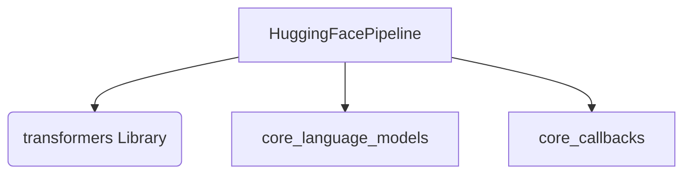

# partners_huggingface_llms Module Documentation

## Introduction

The `partners_huggingface_llms` module provides an interface to integrate HuggingFace models into the LangChain ecosystem. Specifically, it offers the `HuggingFacePipeline` class, enabling the use of various HuggingFace models for tasks such as text generation, text-to-text generation, summarization, and translation through their `transformers` pipeline API. This module abstracts the complexities of setting up and running HuggingFace pipelines, making it straightforward to leverage these powerful models within applications.

## Purpose and Core Functionality

The primary purpose of this module is to serve as a bridge between the LangChain `BaseLLM` interface and HuggingFace's `transformers` pipelines. It allows developers to:

*   **Initialize HuggingFace models**: Easily create LLM instances from HuggingFace model IDs and specified tasks (e.g., "text-generation", "summarization").
*   **Utilize pre-configured pipelines**: Integrate existing `transformers` pipeline objects directly.
*   **Support various NLP tasks**: Handle common tasks like text generation, text-to-text generation, summarization, and translation.
*   **Manage model and pipeline parameters**: Pass keyword arguments to both the underlying HuggingFace model and the pipeline for fine-grained control.
*   **Batch processing**: Efficiently process multiple prompts using configurable batch sizes.
*   **Streaming responses**: Support real-time token streaming for interactive applications.
*   **Backend optimization**: Integrate with optimized backends like OpenVINO and IPEX for improved inference performance.

## Architecture and Component Relationships

The `partners_huggingface_llms` module centers around the `HuggingFacePipeline` class, which extends the `BaseLLM` class from the `core_language_models` module. This design ensures compatibility with the broader LangChain LLM interface.

<!-- DIAGRAM_JSON
{
    "direction": "TD",
    "nodes": [
        {"id": "huggingface_pipeline", "label": "HuggingFacePipeline", "type": "component", "link": null},
        {"id": "transformers", "label": "transformers (Library)", "type": "external", "link": null},
        {"id": "core_language_models", "label": "core_language_models", "type": "external", "link": "core_language_models.md"},
        {"id": "core_callbacks", "label": "core_callbacks", "type": "external", "link": "core_callbacks.md"}
    ],
    "edges": [
        {"source": "huggingface_pipeline", "target": "transformers"},
        {"source": "huggingface_pipeline", "target": "core_language_models"},
        {"source": "huggingface_pipeline", "target": "core_callbacks"}
    ],
    "groups": []
}
-->

### Component Breakdown:

*   **HuggingFacePipeline**: This is the core class that encapsulates the logic for interacting with HuggingFace `transformers` pipelines. It handles model loading, pipeline creation, and the generation/streaming of responses. It implements the `_generate` and `_stream` methods required by `BaseLLM`.
*   **`transformers` (Library)**: An external dependency providing the `pipeline` function, `AutoTokenizer`, `AutoModelForCausalLM`, and `AutoModelForSeq2SeqLM` classes crucial for model and tokenizer loading and pipeline execution.
*   **`core_language_models`**: This external module provides the `BaseLLM` abstract base class, which `HuggingFacePipeline` extends. This ensures that `HuggingFacePipeline` adheres to the standard LLM interface within the system. For more details, refer to the [core_language_models.md](core_language_models.md) documentation.
*   **`core_callbacks`**: This external module provides `CallbackManagerForLLMRun`, which is used in the `_generate` and `_stream` methods for handling callbacks during LLM execution. For more details, refer to the [core_callbacks.md](core_callbacks.md) documentation.

## How the Module Fits into the Overall System

The `partners_huggingface_llms` module plays a vital role in expanding the system's capabilities by integrating a wide array of HuggingFace models. It allows the system to leverage state-of-the-art open-source and proprietary models available through the HuggingFace ecosystem without requiring significant changes to the core LLM interaction logic.

By conforming to the `BaseLLM` interface, `HuggingFacePipeline` can be seamlessly swapped with other LLM implementations (e.g., `partners_anthropic_llms`, `partners_openai_chat_models`). This modularity enables developers to easily experiment with different language models and select the most suitable one for their specific application, enhancing flexibility and extensibility across the entire system. It is part of the `partners` group of modules, indicating its role in providing integrations with third-party LLM providers.