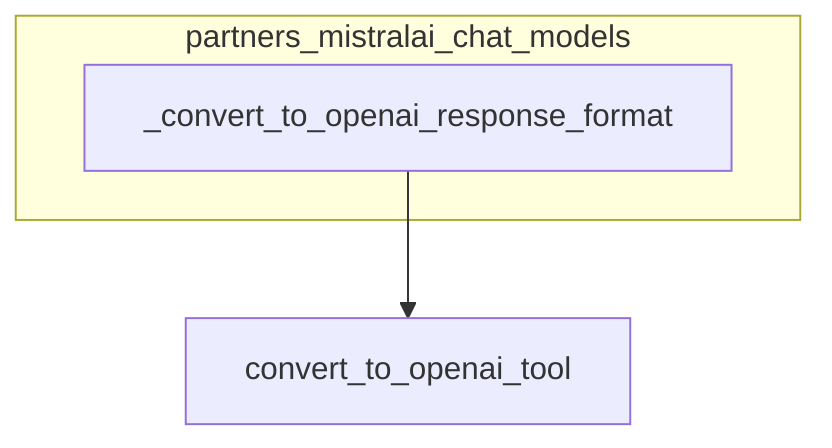

# partners_mistralai_chat_models

## Introduction
This module provides utilities for integrating MistralAI chat models with the LangChain ecosystem, specifically focusing on ensuring that the output from these models conforms to the OpenAI response format when structured outputs are desired. This enables seamless interoperability with other LangChain components and tools that are designed to work with OpenAI-style structured outputs.

## Comprehensive Documentation

### Purpose and Core Functionality
The `partners_mistralai_chat_models` module acts as an adapter, translating various schema definitions into a standardized OpenAI-compatible `json_schema` response format. This is particularly crucial when working with MistralAI chat models that need to produce structured outputs, allowing them to be used effectively within a broader LangChain application that might expect this specific output structure.

The primary component, `_convert_to_openai_response_format`, is responsible for this conversion. It intelligently handles different input schema types, including:
*   Pre-formatted `json_schema` dictionaries.
*   Dictionaries with a `name` and `schema` field.
*   Generic schema types (e.g., Pydantic models or other Python types) that need to be converted into a function-like OpenAI tool definition before being wrapped in the `json_schema` format.

It also manages a `strict` parameter to control the validation behavior of the generated schema, ensuring consistency and preventing conflicts if `strict` is defined in multiple places.

### Architecture and Component Relationships

The `partners_mistralai_chat_models` module is a leaf module, containing a single core utility function that performs schema conversion.

<!-- DIAGRAM_JSON
{
    "direction": "TD",
    "nodes": [
        {"id": "A", "label": "_convert_to_openai_response_format", "type": "component", "link": null},
        {"id": "B", "label": "convert_to_openai_tool", "type": "external", "link": null}
    ],
    "edges": [
        {"source": "A", "target": "B"}
    ],
    "groups": [
        {"id": "partners_mistralai_chat_models", "label": "partners_mistralai_chat_models", "nodes": ["A"]}
    ]
}
-->

**Relationship Details:**

*   **`_convert_to_openai_response_format`**: This is the central function within the module. Its primary role is to accept various schema definitions and standardize them into a format compatible with OpenAI's structured output specifications, specifically a dictionary with `{"type": "json_schema", "json_schema": ...}`.
*   **`convert_to_openai_tool`**: This is an external utility function that `_convert_to_openai_response_format` relies on. When the input schema is not already a pre-formatted JSON schema, this function is invoked to transform the schema into an OpenAI-compatible tool definition, which includes converting its parameters into a JSON schema representation. The exact origin of `convert_to_openai_tool` is not specified in the current module tree, but it is likely found in a core LangChain utility module or an OpenAI-specific integration module (e.g., `langchain_core.tools.convert` or `langchain_openai.tools`).

### How the Module Fits into the Overall System

The `partners_mistralai_chat_models` module plays a vital role in enabling advanced functionalities for MistralAI chat models within the LangChain framework, particularly those requiring structured outputs. By converting various schema definitions into a universally understood OpenAI `json_schema` format, it allows MistralAI models to:

*   **Produce structured responses**: Essential for use cases like function calling, data extraction, and interacting with external APIs where specific data formats are required.
*   **Interoperate with existing tools and agents**: Many LangChain agents and tools are designed to consume or produce outputs in the OpenAI structured output format. This module ensures that MistralAI models can seamlessly participate in these workflows.
*   **Maintain consistency**: It helps enforce a consistent interface for structured outputs across different large language models (LLMs) integrated into LangChain, simplifying development and maintenance.

This module primarily serves as a foundational utility for higher-level components that leverage MistralAI models for structured generation tasks, making the MistralAI integration robust and flexible.