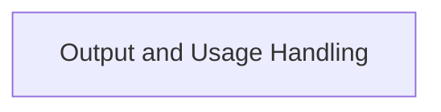

# partners_openai_chat_models Module

## Introduction

The `partners_openai_chat_models` module provides the core functionalities for interacting with OpenAI's chat models within the LangChain framework. It handles the processing of structured outputs from the models and the creation of detailed usage metadata.

## Architecture

The module is structured to manage the intricacies of OpenAI API responses, focusing on robust output parsing and comprehensive usage tracking. The primary sub-module within `partners_openai_chat_models` is dedicated to these tasks, ensuring that responses are correctly interpreted and resource consumption is accurately recorded.

<!-- DIAGRAM_JSON
{
    "direction": "TD",
    "nodes": [
        {"id": "output_and_usage_handling", "label": "Output and Usage Handling", "type": "module", "link": "output_and_usage_handling.md"}
    ],
    "edges": [],
    "groups": []
}
-->

## Sub-modules

### [Output and Usage Handling](output_and_usage_handling.md)
This sub-module is responsible for parsing structured outputs from OpenAI chat models and generating detailed usage metadata for API calls. It ensures that model responses are correctly interpreted according to defined schemas and that token usage and service tier information are accurately captured.