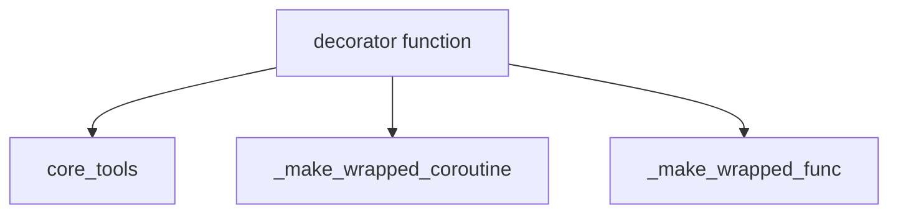

# partners_openai_tools Module Documentation

## Introduction

The `partners_openai_tools` module provides utilities for defining and managing custom tools specifically designed for integration with OpenAI models. Its core functionality revolves around a decorator that transforms regular Python functions into callable tools, enriching them with metadata and ensuring proper execution, whether synchronous or asynchronous.

## Purpose and Core Functionality

This module's primary purpose is to facilitate the creation of custom tools for OpenAI integrations. It offers a straightforward way to expose Python functions as tools that can be used by language models.

### `decorator` Function

Located in `libs/partners/openai/langchain_openai/tools/custom_tool.py`, the `decorator` function is the central component of this module. It acts as a factory for creating tool objects from standard Python functions.

**Key functionalities of the `decorator`:**

*   **Tool Transformation:** It wraps a given callable function (`func`) and transforms it into a `tool_obj`.
*   **Metadata Assignment:** It automatically assigns a `type` of "custom_tool" to the tool. If a "format" argument is provided in `kwargs`, it's also added to the tool's metadata.
*   **Description Generation:** The tool's description is automatically extracted from the docstring of the wrapped function (`func.__doc__`).
*   **Asynchronous Support:** It intelligently detects if the wrapped function is a coroutine (asynchronous) and assigns the appropriate wrapped function (`_make_wrapped_coroutine` or `_make_wrapped_func`) to handle its execution.

**Code Snippet:**

```python
    def decorator(func: Callable[..., Any]) -> Any:
        metadata = {"type": "custom_tool"}
        if "format" in kwargs:
            metadata["format"] = kwargs.pop("format")
        tool_obj = tool(infer_schema=False, **kwargs)(func)
        tool_obj.metadata = metadata
        tool_obj.description = func.__doc__
        if inspect.iscoroutinefunction(func):
            tool_obj.coroutine = _make_wrapped_coroutine(func)
        else:
            tool_obj.func = _make_wrapped_func(func)
        return tool_obj
```

## Architecture and Component Relationships

The `partners_openai_tools` module is a self-contained unit focused on tool creation. Its main component, the `decorator` function, orchestrates the transformation of a Python callable into a usable tool object.

*   **Internal Components:** The `decorator` relies on internal helper functions, `_make_wrapped_coroutine` and `_make_wrapped_func` (whose implementations are abstracted within the module), to correctly handle synchronous and asynchronous function execution.
*   **External Dependencies:** The `decorator` leverages the base `tool` function (likely from the `core_tools` module) to perform the fundamental wrapping and schema inference for tool objects. This dependency ensures consistency with the broader tool definition framework.

## How the Module Fits into the Overall System

This module is an integral part of the `partners_openai` ecosystem, providing the essential building blocks for custom tool development. It allows developers to extend the capabilities of OpenAI-powered applications by integrating custom logic and operations as callable tools. These tools can then be utilized by agents or language models to perform specific actions, retrieve information, or interact with external systems. It indirectly supports modules like `classic_agents.openai_agents` by providing the tools they can execute.

<!-- DIAGRAM_JSON
{
    "direction": "TD",
    "nodes": [
        {"id": "decorator", "label": "decorator function", "type": "component", "link": null},
        {"id": "make_wrapped_coroutine", "label": "_make_wrapped_coroutine", "type": "component", "link": null},
        {"id": "make_wrapped_func", "label": "_make_wrapped_func", "type": "component", "link": null},
        {"id": "core_tools", "label": "core_tools", "type": "external", "link": "core_tools.md"}
    ],
    "edges": [
        {"source": "decorator", "target": "core_tools"},
        {"source": "decorator", "target": "make_wrapped_coroutine"},
        {"source": "decorator", "target": "make_wrapped_func"}
    ],
    "groups": []
}
-->

