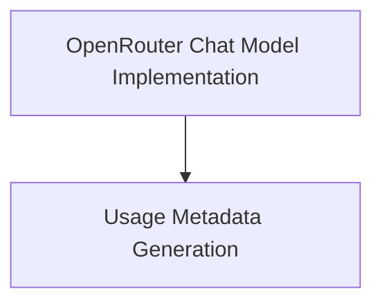

# partners_openrouter_chat_models

This module provides the integration for OpenRouter chat models within the LangChain framework, enabling access to a wide variety of large language models through a unified API.

## Architecture

The `partners_openrouter_chat_models` module is structured into the following key components:

<!-- DIAGRAM_JSON
{
    "direction": "TD",
    "nodes": [
        {"id": "chat_model_implementation", "label": "OpenRouter Chat Model Implementation", "type": "module", "link": "chat_model_implementation.md"},
        {"id": "usage_metadata_generation", "label": "Usage Metadata Generation", "type": "module", "link": "usage_metadata_generation.md"}
    ],
    "edges": [
        {"source": "chat_model_implementation", "target": "usage_metadata_generation"}
    ],
    "groups": []
}
-->

## Module Functionality

### [OpenRouter Chat Model Implementation](chat_model_implementation.md)
This sub-module contains the core `ChatOpenRouter` class, which serves as the primary interface for interacting with OpenRouter's chat completion API. It handles model configuration, API key management, request processing, and response parsing.

### [Usage Metadata Generation](usage_metadata_generation.md)
This sub-module provides utility functions, specifically `_create_usage_metadata`, for parsing and structuring token usage details from OpenRouter API responses. It ensures that usage metrics are consistently reported within the LangChain framework.