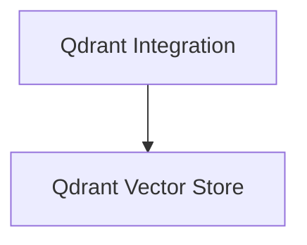

# partners_qdrant_vectorstores

This module provides robust integrations with Qdrant, a high-performance vector similarity search engine. It includes two primary classes: `QdrantVectorStore` for flexible vector storage and retrieval with support for dense, sparse, and hybrid embeddings, and `Qdrant` for broader Qdrant client integration and vector store operations.

## Architecture Overview

The `partners_qdrant_vectorstores` module is structured into two main components, each handling specific aspects of Qdrant integration:

<!-- DIAGRAM_JSON
{
    "direction": "TD",
    "nodes": [
        {"id": "qdrant_vectorstore_class", "label": "Qdrant Vector Store", "type": "module", "link": "qdrant_vectorstore_class.md"},
        {"id": "qdrant_integration_class", "label": "Qdrant Integration", "type": "module", "link": "qdrant_integration_class.md"}
    ],
    "edges": [
        {"source": "qdrant_integration_class", "target": "qdrant_vectorstore_class"}
    ],
    "groups": []
}
-->

## Sub-modules

- ### [Qdrant Vector Store](qdrant_vectorstore_class.md)
  The `QdrantVectorStore` class offers a comprehensive integration with Qdrant for managing and querying vector embeddings, supporting dense, sparse, and hybrid retrieval modes.

- ### [Qdrant Integration](qdrant_integration_class.md)
  The `Qdrant` class is a versatile LangChain vector store integration for Qdrant, supporting various search functionalities and collection management.
