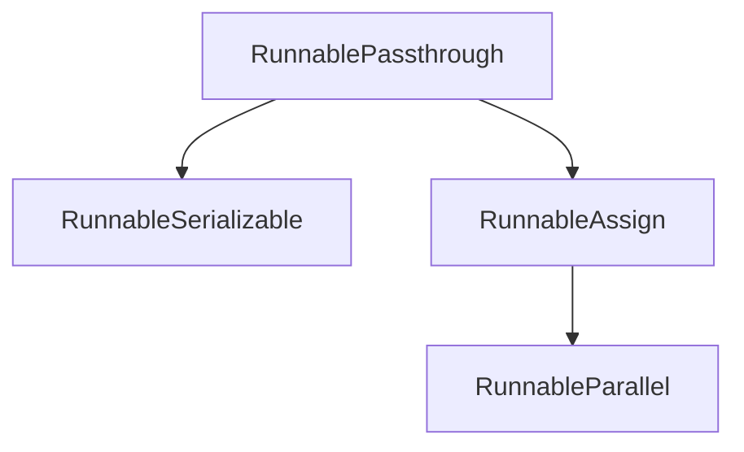

# `passthrough_runnables`

The `passthrough_runnables` module introduces `RunnablePassthrough`, a flexible `Runnable` designed to either pass its inputs unchanged or to enhance them by adding new keys, particularly useful when the input is a dictionary. This module is a core part of the [core_runnables](core_runnables.md) system, providing essential utility for constructing complex and adaptable data flows within LangChain expressions.

## Comprehensive Documentation

### Purpose and Core Functionality

The primary purpose of `RunnablePassthrough` is to act as an identity transformation or to facilitate the injection of additional data into a dictionary-based input stream without altering the original input. This capability is invaluable in scenarios where you need to branch a chain, capture an intermediate result, or augment the data payload as it flows through a series of runnables.

Key functionalities include:

*   **Identity Operation:** By default, `RunnablePassthrough` simply returns its input. This is useful for creating branches in a [RunnableParallel](base_runnables.md) construct where one branch needs the original input while others process it.
*   **Input Augmentation (`assign` method):** The `assign` class method allows for the dynamic addition of new keys to a dictionary input. This is particularly powerful for enriching the context of a runnable chain with computed values derived from existing inputs or other runnable outputs. The `assign` method internally uses [RunnableParallel](base_runnables.md) to execute the new key's logic and [RunnableAssign](base_runnables.md) to merge the results.

**Example Usage:**

Consider a scenario where you want to pass an LLM's output through directly, but also apply a transformation and add it as a new key:

```python
from langchain_core.runnables import (
    RunnableLambda,
    RunnableParallel,
    RunnablePassthrough,
)

# Example 1: Identity and simple modification in parallel
runnable_parallel_example = RunnableParallel(
    origin=RunnablePassthrough(),
    modified=lambda x: x + 1
)
runnable_parallel_example.invoke(1)
# Expected output: {'origin': 1, 'modified': 2}

# Example 2: Augmenting LLM output
def fake_llm(prompt: str) -> str:
    return "completion"

chain_with_passthrough = RunnableLambda(fake_llm) | {
    "original": RunnablePassthrough(),
    "parsed": lambda text: text[::-1],
}
chain_with_passthrough.invoke("hello")
# Expected output: {'original': 'completion', 'parsed': 'noitelpmoc'}

# Example 3: Using assign to add new keys
def another_fake_llm(prompt: str) -> str:
    return "completion"

runnable_assign_example = {
    "llm1": another_fake_llm,
    "llm2": another_fake_llm,
} | RunnablePassthrough.assign(
    total_chars=lambda inputs: len(inputs["llm1"] + inputs["llm2"])
)
runnable_assign_example.invoke("hello")
# Expected output: {'llm1': 'completion', 'llm2': 'completion', 'total_chars': 20}
```

### Architecture and Component Relationships

The `passthrough_runnables` module primarily exposes the `RunnablePassthrough` class, which extends [RunnableSerializable](base_runnables.md), inheriting its serialization capabilities and foundational `Runnable` interface.

<!-- DIAGRAM_JSON
{
    "direction": "TD",
    "nodes": [
        {"id": "runnable_passthrough", "label": "RunnablePassthrough", "type": "component", "link": null},
        {"id": "runnable_serializable", "label": "RunnableSerializable", "type": "external", "link": "base_runnables.md"},
        {"id": "runnable_parallel", "label": "RunnableParallel", "type": "external", "link": "base_runnables.md"},
        {"id": "runnable_assign", "label": "RunnableAssign", "type": "external", "link": "base_runnables.md"}
    ],
    "edges": [
        {"source": "runnable_passthrough", "target": "runnable_serializable"},
        {"source": "runnable_passthrough", "target": "runnable_assign"},
        {"source": "runnable_assign", "target": "runnable_parallel"}
    ],
    "groups": []
}
-->


**Relationships:**

*   **`RunnablePassthrough`** is the central component of this module, providing the passthrough and assignment functionalities.
*   It inherits from **`RunnableSerializable`** (defined in [base_runnables](base_runnables.md)), making it serializable and compatible with the broader LangChain `Runnable` ecosystem.
*   The `assign` method of `RunnablePassthrough` creates and returns an instance of **`RunnableAssign`** (also defined in [base_runnables](base_runnables.md)).
*   **`RunnableAssign`** itself leverages **`RunnableParallel`** (from [base_runnables](base_runnables.md)) to execute the logic for the new keys in parallel before merging them with the original input.

### How the Module Fits into the Overall System

The `passthrough_runnables` module, through `RunnablePassthrough`, plays a crucial role in enabling more dynamic and expressive chain construction within the LangChain framework. It allows developers to:

*   **Control Data Flow:** Precisely manage which data is passed along a chain, enabling selective data processing and enrichment.
*   **Simplify Complex Chains:** Break down complex transformations into smaller, more manageable steps, especially when combined with other runnables like [RunnableParallel](base_runnables.md).
*   **Enhance Modularity:** Create reusable components that can augment inputs without needing to modify the upstream runnables directly.

It integrates seamlessly with other `core_runnables` components, serving as a foundational building block for advanced LangChain expressions, agents, and data processing pipelines. Its `assign` method is particularly powerful for preparing inputs for subsequent runnables that require a specific dictionary structure or additional contextual information.