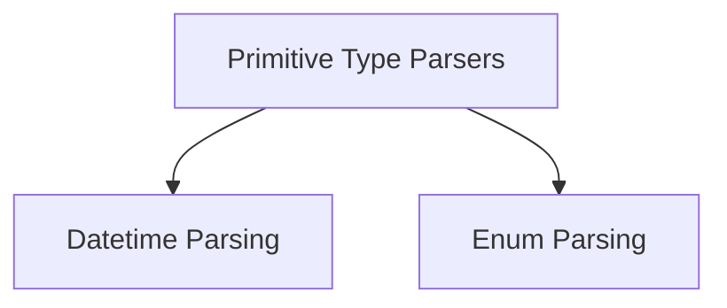

# Primitive Type Parsers Module

The `primitive_type_parsers` module provides a set of output parsers specifically designed to convert language model outputs into standard Python primitive types like `datetime` objects and `Enum` members. This module is essential for enforcing type safety and ensuring that LLM responses can be easily integrated and processed within typed systems.

## Architecture Overview

The module is structured into specialized sub-modules, each handling the parsing of a particular primitive type. The current architecture includes parsers for `datetime` and `Enum` types, with a clear separation of concerns to facilitate extensibility and maintainability.

<!-- DIAGRAM_JSON
{
    "direction": "TD",
    "nodes": [
        {"id": "datetime_parser", "label": "Datetime Parsing", "type": "module", "link": "datetime_parser.md"},
        {"id": "enum_parser", "label": "Enum Parsing", "type": "module", "link": "enum_parser.md"}
    ],
    "edges": [
        {"source": "primitive_type_parsers", "target": "datetime_parser"},
        {"source": "primitive_type_parsers", "target": "enum_parser"}
    ],
    "groups": []
}
-->

## Sub-modules

### [Datetime Parsing](datetime_parser.md)
This sub-module contains the `DatetimeOutputParser` component, which is responsible for parsing string outputs into `datetime` objects. It allows developers to specify a desired datetime format, providing flexibility in how datetime strings are processed from LLM responses.

### [Enum Parsing](enum_parser.md)
This sub-module includes the `EnumOutputParser` component, designed to parse string outputs into members of a specified Python `Enum`. It ensures that the parsed string strictly matches one of the defined `Enum` values, thus enforcing valid selections from a predefined set of options.