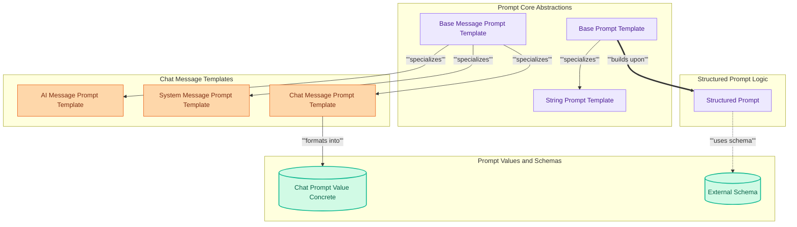

# Prompt Definitions Module

This module defines various prompt templates and structures, including base classes for different prompt types, chat-specific message templates (AI, system, chat), and structured prompts with schema definitions for precise model interaction.

<!-- DIAGRAM_JSON
{
    "direction": "TD",
    "nodes": [
        {"id": "base_prompt", "label": "Base Prompt Template", "type": "module"},
        {"id": "base_msg_prompt", "label": "Base Message Prompt Template", "type": "module"},
        {"id": "string_prompt", "label": "String Prompt Template", "type": "module"},
        {"id": "chat_prompt_value", "label": "Chat Prompt Value Concrete", "type": "module"},
        {"id": "ai_msg_template", "label": "AI Message Prompt Template", "type": "module"},
        {"id": "sys_msg_template", "label": "System Message Prompt Template", "type": "module"},
        {"id": "chat_msg_template", "label": "Chat Message Prompt Template", "type": "module"},
        {"id": "structured_prompt", "label": "Structured Prompt", "type": "module"},
        {"id": "external_schema", "label": "External Schema", "type": "external"}
    ],
    "edges": [
        {"source": "base_prompt", "target": "string_prompt", "label": "specializes"},
        {"source": "base_msg_prompt", "target": "ai_msg_template", "label": "specializes"},
        {"source": "base_msg_prompt", "target": "sys_msg_template", "label": "specializes"},
        {"source": "base_msg_prompt", "target": "chat_msg_template", "label": "specializes"},
        {"source": "chat_msg_template", "target": "chat_prompt_value", "label": "formats into"},
        {"source": "base_prompt", "target": "structured_prompt", "label": "builds upon"},
        {"source": "structured_prompt", "target": "external_schema", "label": "uses schema"}
    ],
    "groups": [
        {"id": "prompt_abstractions", "label": "Prompt Core Abstractions", "role": "analytical", "nodes": ["base_prompt", "base_msg_prompt", "string_prompt"]},
        {"id": "chat_prompts", "label": "Chat Message Templates", "role": "generative", "nodes": ["ai_msg_template", "sys_msg_template", "chat_msg_template"]},
        {"id": "structured_processing", "label": "Structured Prompt Logic", "role": "analytical", "nodes": ["structured_prompt"]},
        {"id": "prompt_values", "label": "Prompt Values and Schemas", "role": "data", "nodes": ["chat_prompt_value", "external_schema"]}
    ]
}
-->
```
