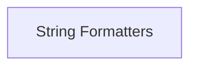

# prompt_formatters Module Documentation

## Introduction

The `prompt_formatters` module is responsible for providing various string formatting utilities specifically designed for prompt templates. It enables the use of different templating engines to dynamically insert variables into prompt strings, enhancing flexibility and reusability of prompts within the system.

## Architecture

The `prompt_formatters` module currently consists of a single sub-module: `string_formatters`, which encapsulates the logic for different templating engines.

<!-- DIAGRAM_JSON
{
    "direction": "TD",
    "nodes": [
        {"id": "string_formatters", "label": "String Formatters", "type": "module", "link": "string_formatters.md"}
    ],
    "edges": [],
    "groups": []
}
-->

## Sub-modules

### [String Formatters](string_formatters.md)

This sub-module provides utilities for formatting prompt templates using various string templating engines like Jinja2 and Mustache. It includes functionalities to safely render templates with provided variables, ensuring dynamic and flexible prompt generation.