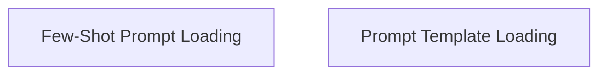

# Prompt Loading Module

The `prompt_loading` module is responsible for dynamically loading and configuring various types of prompt templates within the system. It provides utilities to load both standard `PromptTemplate` objects and `FewShotPromptTemplate` instances from a given configuration, handling template formats, examples, and security considerations.

## Architecture Overview

The module is structured into two main sub-modules, each focusing on a specific type of prompt loading:

<!-- DIAGRAM_JSON
{
    "direction": "TD",
    "nodes": [
        {"id": "few_shot_prompt_loader", "label": "Few-Shot Prompt Loading", "type": "module", "link": "few_shot_prompt_loader.md"},
        {"id": "prompt_template_loader", "label": "Prompt Template Loading", "type": "module", "link": "prompt_template_loader.md"}
    ],
    "edges": [],
    "groups": []
}
-->

## Sub-modules

### [Few-Shot Prompt Loading](few_shot_prompt_loader.md)
This sub-module focuses on loading and configuring `FewShotPromptTemplate` objects. It manages the process of loading example prompts and examples, ensuring proper setup for few-shot learning scenarios.

### [Prompt Template Loading](prompt_template_loader.md)
This sub-module is dedicated to loading standard `PromptTemplate` instances. It handles the parsing of template strings, validates template formats, and raises security warnings for deprecated or unsafe formats like `jinja2`.