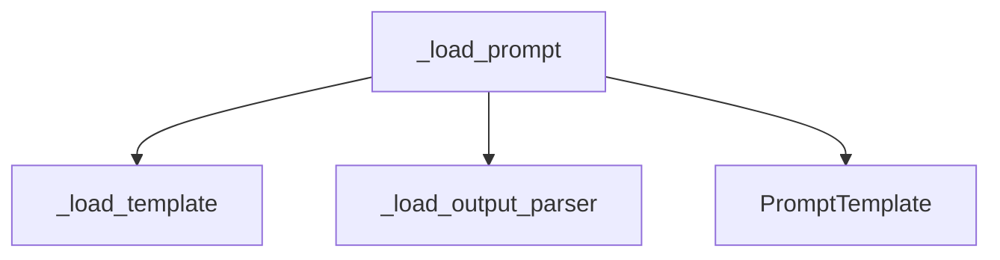

# prompt_template_loader

## Introduction

The `prompt_template_loader` module is a crucial component within the `core_prompts.prompt_loading` system. Its primary responsibility is to load and process prompt templates from various configurations, ensuring their validity and applying necessary transformations before they are used to generate prompts. A key feature of this module is its robust security mechanism, which prevents the loading of templates from potentially dangerous formats like `jinja2` to mitigate arbitrary code execution risks.

## Architecture and Component Relationships

The `prompt_template_loader` module primarily exposes the `_load_prompt` function, which orchestrates the loading process. This function relies on internal helper components to handle specific aspects of template loading and integrates with external modules for core prompt template definitions.

<!-- DIAGRAM_JSON
{
    "direction": "TD",
    "nodes": [
        {"id": "load_prompt", "label": "_load_prompt", "type": "component", "link": null},
        {"id": "load_template", "label": "_load_template", "type": "component", "link": null},
        {"id": "load_output_parser", "label": "_load_output_parser", "type": "component", "link": null},
        {"id": "prompt_template", "label": "PromptTemplate", "type": "external", "link": "core_prompts_prompt_templates_base.md"}
    ],
    "edges": [
        {"source": "load_prompt", "target": "load_template"},
        {"source": "load_prompt", "target": "load_output_parser"},
        {"source": "load_prompt", "target": "prompt_template"}
    ],
    "groups": []
}
-->



### Core Components

#### `_load_prompt`

`_load_prompt` is the main entry point for loading prompt templates. It takes a configuration dictionary and an `allow_dangerous_paths` flag as input. Its responsibilities include:

*   **Template Loading**: It delegates to the `_load_template` helper to retrieve the actual template content, potentially from disk, based on the provided configuration.
*   **Output Parser Loading**: It processes any associated output parser configurations by calling `_load_output_parser`.
*   **Security Validation**: It performs a critical security check, specifically disallowing `jinja2` as a template format due to known vulnerabilities related to arbitrary code execution. If a `jinja2` template is detected, a `ValueError` is raised.
*   **PromptTemplate Instantiation**: Finally, it uses the processed configuration to instantiate and return a `PromptTemplate` object, which is ready for use in prompt generation.

```python
def _load_prompt(
    config: dict, *, allow_dangerous_paths: bool = False
) -> PromptTemplate:
    """Load the prompt template from config."""
    # Load the template from disk if necessary.
    config = _load_template(
        "template", config, allow_dangerous_paths=allow_dangerous_paths
    )
    config = _load_output_parser(config)

    template_format = config.get("template_format", "f-string")
    if template_format == "jinja2":
        # Disabled due to:
        # https://github.com/langchain-ai/langchain/issues/4394
        msg = (
            f"Loading templates with '{template_format}' format is no longer supported "
            f"since it can lead to arbitrary code execution. Please migrate to using "
            f"the 'f-string' template format, which does not suffer from this issue."
        )
        raise ValueError(msg)

    return PromptTemplate(**config)
```

### Dependencies

*   **`_load_template` (Internal)**: A helper function responsible for loading the raw template content based on the configuration.
*   **`_load_output_parser` (Internal)**: A helper function that processes output parser definitions within the template configuration.
*   **`PromptTemplate` (External)**: This class, likely defined in the [core_prompts_prompt_templates_base module](core_prompts_prompt_templates_base.md), represents the base structure for all prompt templates and is the ultimate output of the `_load_prompt` function.

## How the Module Fits into the Overall System

The `prompt_template_loader` module is a vital part of the `core_prompts` system, specifically residing within the `prompt_loading` sub-module. It acts as the initial processing layer for prompt definitions, taking raw configurations and transforming them into usable `PromptTemplate` objects. This module ensures that all loaded prompts adhere to security standards and are correctly formatted before being utilized by other components in the prompt generation and language model interaction pipeline. Its position ensures that only validated and properly constructed prompt templates are introduced into the system, contributing to the overall stability and security of the application.
