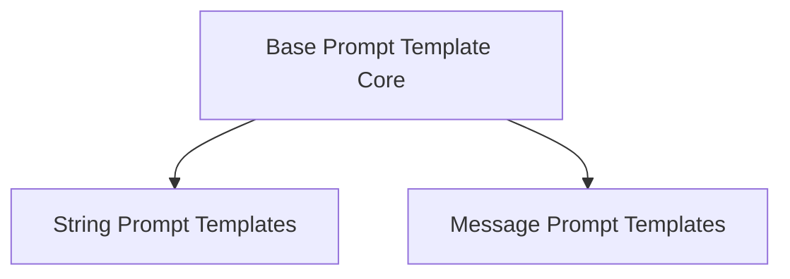

# prompt_templates_base Module Documentation

## Introduction

The `prompt_templates_base` module serves as the foundational layer for creating and managing prompt templates within the LangChain Core. It defines the abstract structures and core functionalities common to all prompt templates, whether they are designed for generating simple strings or complex lists of chat messages. This module enables developers to build flexible, reusable, and robust prompt engineering solutions for interacting with various language models.

## Architecture Overview

The architecture of the `prompt_templates_base` module is centered around a primary abstract class, `BasePromptTemplate`. This class establishes the fundamental interface and common properties that all concrete prompt template implementations must adhere to. Building upon this base, the module provides specialized sub-modules for different types of prompt outputs, such as single strings and lists of chat messages.

<!-- DIAGRAM_JSON
{
    "direction": "TD",
    "nodes": [
        {"id": "base_prompt_template_core", "label": "Base Prompt Template Core", "type": "module", "link": "base_prompt_template_core.md"},
        {"id": "string_prompt_templates", "label": "String Prompt Templates", "type": "module", "link": "string_prompt_templates.md"},
        {"id": "message_prompt_templates", "label": "Message Prompt Templates", "type": "module", "link": "message_prompt_templates.md"}
    ],
    "edges": [
        {"source": "base_prompt_template_core", "target": "string_prompt_templates"},
        {"source": "base_prompt_template_core", "target": "message_prompt_templates"}
    ],
    "groups": []
}
-->

## Sub-modules

### [Base Prompt Template Core](base_prompt_template_core.md)
This sub-module defines the fundamental `BasePromptTemplate` class. It serves as the abstract base for all prompt templates, establishing common properties and methods like input variable management, partial application, and invocation logic. This core class ensures consistency and extensibility across different prompt template implementations.

### [String Prompt Templates](string_prompt_templates.md)
This sub-module provides the `StringPromptTemplate` class, an abstract class designed for prompts that produce a single string as their output. It extends `BasePromptTemplate` and focuses on capabilities related to formatting inputs into a coherent string, which is often used for simpler, direct language model interactions.

### [Message Prompt Templates](message_prompt_templates.md)
This sub-module introduces the `BaseMessagePromptTemplate` class, an abstract base for prompt templates specifically engineered to generate lists of chat messages. This is crucial for building conversational AI applications where prompts consist of a sequence of messages, allowing for more structured and contextual interactions with language models.