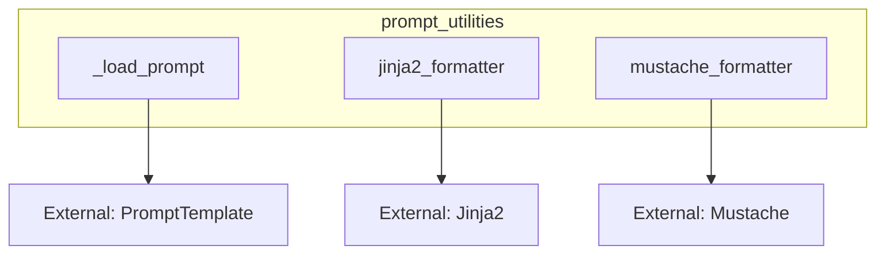

# prompt_utilities
The `prompt_utilities` module offers functions for loading prompt templates from configurations and formatting them using different templating engines such as Jinja2 and Mustache.

<!-- DIAGRAM_JSON
{
  "nodes": [
    {"id": "A", "label": "_load_prompt"},
    {"id": "B", "label": "jinja2_formatter"},
    {"id": "C", "label": "mustache_formatter"},
    {"id": "D", "label": "External: Jinja2"},
    {"id": "E", "label": "External: Mustache"},
    {"id": "F", "label": "External: PromptTemplate"}
  ],
  "edges": [
    {"source": "B", "target": "D"},
    {"source": "C", "target": "E"},
    {"source": "A", "target": "F"}
  ],
  "groups": [
    {"id": "prompt_utilities", "label": "prompt_utilities", "nodes": ["A", "B", "C"]}
  ]
}
-->
