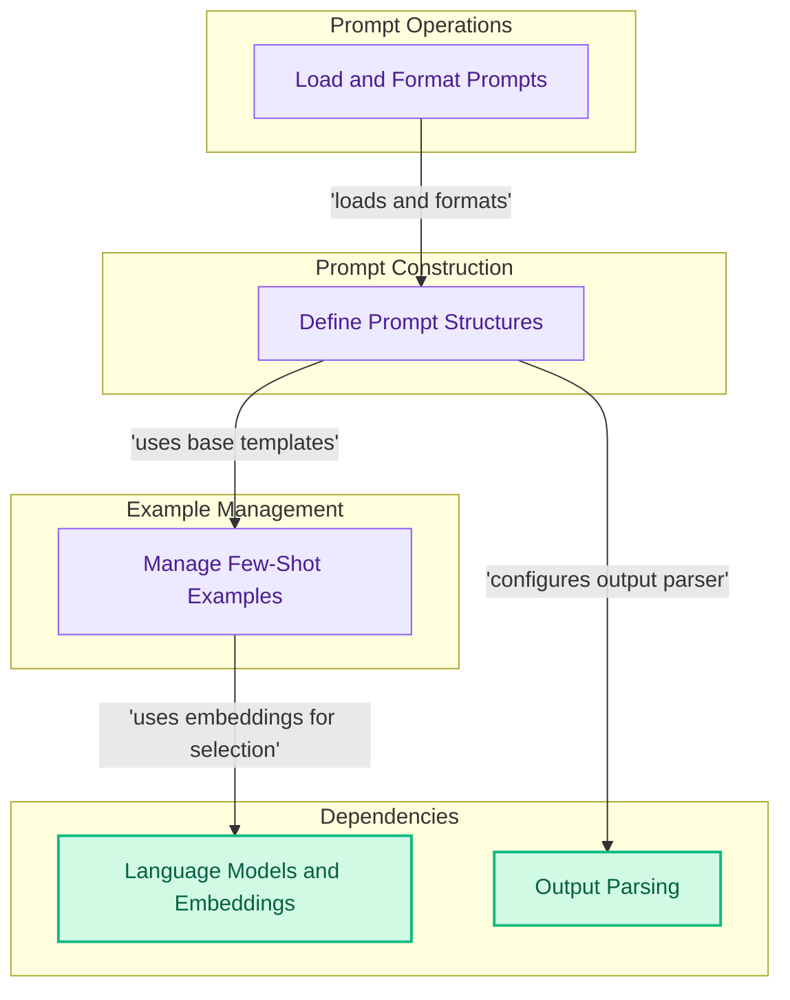

# Prompts and Examples Module
This module provides foundational components for defining, managing, and formatting prompts, including various template types, chat message structures, and mechanisms for few-shot example selection and dynamic prompt loading.

<!-- DIAGRAM_JSON
{
    "direction": "TD",
    "nodes": [
        {
            "id": "prompt_definitions",
            "label": "Define Prompt Structures",
            "type": "module",
            "link": "prompt_definitions.md"
        },
        {
            "id": "few_shot_and_examples",
            "label": "Manage Few-Shot Examples",
            "type": "module",
            "link": "few_shot_and_examples.md"
        },
        {
            "id": "prompt_utilities",
            "label": "Load and Format Prompts",
            "type": "module",
            "link": "prompt_utilities.md"
        },
        {
            "id": "models_and_embeddings",
            "label": "Language Models and Embeddings",
            "type": "external",
            "link": "models_and_embeddings.md"
        },
        {
            "id": "output_parsing",
            "label": "Output Parsing",
            "type": "external",
            "link": "output_parsing.md"
        }
    ],
    "edges": [
        {
            "source": "prompt_definitions",
            "target": "few_shot_and_examples",
            "label": "uses base templates"
        },
        {
            "source": "few_shot_and_examples",
            "target": "models_and_embeddings",
            "label": "uses embeddings for selection"
        },
        {
            "source": "prompt_definitions",
            "target": "output_parsing",
            "label": "configures output parser"
        },
        {
            "source": "prompt_utilities",
            "target": "prompt_definitions",
            "label": "loads and formats"
        }
    ],
    "groups": [
        {
            "id": "prompt_construction",
            "label": "Prompt Construction",
            "role": "analytical",
            "nodes": [
                "prompt_definitions"
            ]
        },
        {
            "id": "example_management",
            "label": "Example Management",
            "role": "analytical",
            "nodes": [
                "few_shot_and_examples"
            ]
        },
        {
            "id": "prompt_operations",
            "label": "Prompt Operations",
            "role": "analytical",
            "nodes": [
                "prompt_utilities"
            ]
        },
        {
            "id": "external_deps",
            "label": "Dependencies",
            "role": "data",
            "nodes": [
                "models_and_embeddings",
                "output_parsing"
            ]
        }
    ]
}
-->
