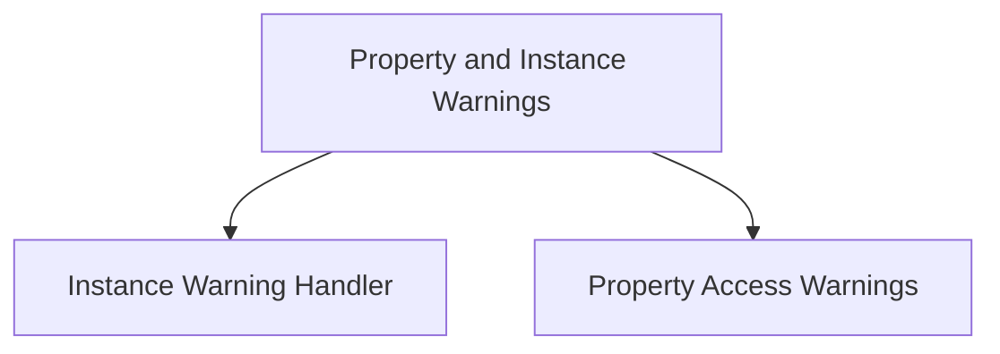

# property_and_instance_warnings Module Documentation

## Introduction and Purpose

The `property_and_instance_warnings` module is a critical component within the `beta_warnings` system, specifically designed to manage and emit warnings related to the direct instantiation of beta classes and access to beta properties. Its primary purpose is to alert developers when they are using beta features directly, encouraging them to use stable alternatives or acknowledge the experimental nature of the components.

## Architecture Overview

This module is structured into two main sub-modules, each handling a specific aspect of warning generation for beta features:

*   **Instance Warning Handler** ([instance_warnings.md](instance_warnings.md)): Focuses on warning when a beta class is directly instantiated.
*   **Property Access Warnings** ([property_access_warnings.md](property_access_warnings.md)): Deals with warnings triggered during the getting, setting, or deleting of beta properties.

These sub-modules work in conjunction to provide comprehensive warning coverage for beta feature usage within the system.

<!-- DIAGRAM_JSON
{
    "direction": "TD",
    "nodes": [
        {"id": "instance_warnings", "label": "Instance Warning Handler", "type": "module", "link": "instance_warnings.md"},
        {"id": "property_access_warnings", "label": "Property Access Warnings", "type": "module", "link": "property_access_warnings.md"}
    ],
    "edges": [
        {"source": "property_and_instance_warnings", "target": "instance_warnings"},
        {"source": "property_and_instance_warnings", "target": "property_access_warnings"}
    ],
    "groups": []
}
-->

