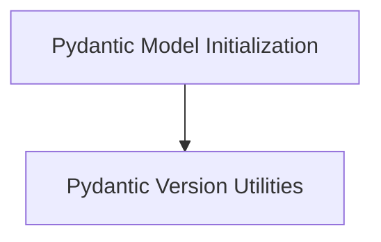

# Pydantic Utilities Module

The `pydantic_utilities` module provides essential utilities for working with Pydantic models within the system. It offers functionalities to streamline model initialization and retrieve Pydantic version information, ensuring compatibility and robust data handling.

## Architecture Overview

The module is composed of two main sub-modules:

<!-- DIAGRAM_JSON
{
    "direction": "TD",
    "nodes": [
        {"id": "model_initialization", "label": "Pydantic Model Initialization", "type": "module", "link": "model_initialization.md"},
        {"id": "version_utilities", "label": "Pydantic Version Utilities", "type": "module", "link": "version_utilities.md"}
    ],
    "edges": [
        {"source": "model_initialization", "target": "version_utilities", "label": "May use version info"}
    ],
    "groups": []
}
-->

## Sub-modules

*   **[Pydantic Model Initialization](model_initialization.md)**: This sub-module contains utilities for customizing Pydantic model initialization, handling field aliases and default values.
*   **[Pydantic Version Utilities](version_utilities.md)**: This sub-module provides functions to query the installed Pydantic version.
