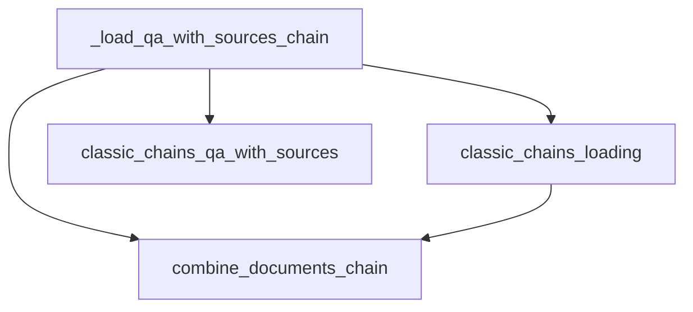

# qa_chain_loader

The `qa_chain_loader` module is responsible for loading and configuring Question Answering with Sources (QA with Sources) chains within the LangChain Classic framework. It provides the necessary logic to instantiate a `QAWithSourcesChain` by dynamically loading its `combine_documents_chain` component.

## Architecture and Core Functionality

The primary function of this module is `_load_qa_with_sources_chain`, which acts as a factory for `QAWithSourcesChain` instances. It takes a configuration dictionary and optional keyword arguments to determine how the underlying `combine_documents_chain` should be loaded.

### Component: `_load_qa_with_sources_chain`

This function is the entry point for loading a QA with Sources chain. It inspects the provided `config` for either a direct `combine_documents_chain` definition or a `combine_documents_chain_path` to load the chain from a specified location. If neither is found, it raises a `ValueError`.

Once the `combine_documents_chain` is successfully loaded, it is used to initialize a `QAWithSourcesChain` object, passing along any remaining configuration parameters.

### Module Relationships

The `qa_chain_loader` module relies on other modules for its functionality:

- **`classic_chains_loading`**: This module is crucial for its `load_chain_from_config` and `load_chain` utilities, which are used to dynamically load the `combine_documents_chain` component based on the provided configuration.
- **`classic_chains_qa_with_sources`**: This module defines the `QAWithSourcesChain` class, which is the primary output of the `qa_chain_loader` module.

## Diagrams

<!-- DIAGRAM_JSON
{
    "direction": "TD",
    "nodes": [
        {"id": "load_qa_with_sources_chain", "label": "_load_qa_with_sources_chain", "type": "component", "link": null},
        {"id": "combine_documents_chain", "label": "combine_documents_chain", "type": "component", "link": null},
        {"id": "classic_chains_loading", "label": "classic_chains_loading", "type": "external", "link": "classic_chains_loading.md"},
        {"id": "classic_chains_qa_with_sources", "label": "classic_chains_qa_with_sources", "type": "external", "link": "classic_chains_qa_with_sources.md"}
    ],
    "edges": [
        {"source": "load_qa_with_sources_chain", "target": "combine_documents_chain"},
        {"source": "load_qa_with_sources_chain", "target": "classic_chains_loading"},
        {"source": "classic_chains_loading", "target": "combine_documents_chain"},
        {"source": "load_qa_with_sources_chain", "target": "classic_chains_qa_with_sources"}
    ],
    "groups": []
}
-->
