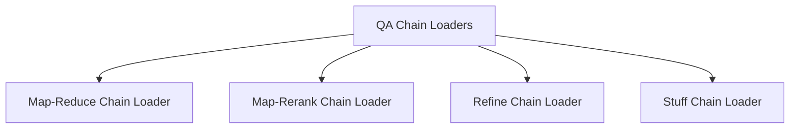

# QA Chain Loaders Module

## Introduction

The `qa_chain_loaders` module provides a set of utilities for loading various types of Question Answering (QA) chains with integrated source handling. These chains implement different strategies for processing documents and generating answers, catering to diverse requirements in terms of document aggregation, summarization, and response generation.

## Architecture Overview

The `qa_chain_loaders` module serves as a central point for instantiating specialized QA chains. Each sub-module within `qa_chain_loaders` encapsulates the logic for loading a specific type of QA chain, defining its document processing strategy and interaction with underlying Language Model (LLM) chains. The architecture is designed to be modular, allowing developers to easily select and configure the appropriate QA chain for their application.

<!-- DIAGRAM_JSON
{
    "direction": "TD",
    "nodes": [
        {"id": "map_reduce_chain_loader", "label": "Map-Reduce Chain Loader", "type": "module", "link": "map_reduce_chain_loader.md"},
        {"id": "map_rerank_chain_loader", "label": "Map-Rerank Chain Loader", "type": "module", "link": "map_rerank_chain_loader.md"},
        {"id": "refine_chain_loader", "label": "Refine Chain Loader", "type": "module", "link": "refine_chain_loader.md"},
        {"id": "stuff_chain_loader", "label": "Stuff Chain Loader", "type": "module", "link": "stuff_chain_loader.md"}
    ],
    "edges": [
        {"source": "qa_chain_loaders", "target": "map_reduce_chain_loader"},
        {"source": "qa_chain_loaders", "target": "map_rerank_chain_loader"},
        {"source": "qa_chain_loaders", "target": "refine_chain_loader"},
        {"source": "qa_chain_loaders", "target": "stuff_chain_loader"}
    ],
    "groups": []
}
-->

## Sub-modules

This module contains the following sub-modules, each responsible for loading a specific type of QA chain:

*   **[Map-Reduce Chain Loader](map_reduce_chain_loader.md)**: This sub-module focuses on loading QA chains that utilize a map-reduce approach to process and summarize multiple documents before generating a final answer.

*   **[Map-Rerank Chain Loader](map_rerank_chain_loader.md)**: This sub-module provides functionality to load QA chains that employ a map-rerank strategy, where documents are initially processed (mapped) and then re-ranked based on relevance to produce a more precise answer.

*   **[Refine Chain Loader](refine_chain_loader.md)**: This sub-module is designed to load QA chains that iteratively refine an answer by processing documents sequentially, building upon previous responses to achieve a more comprehensive and accurate result.

*   **[Stuff Chain Loader](stuff_chain_loader.md)**: This sub-module handles the loading of QA chains that use the 'stuffing' method, where all relevant documents are concatenated and passed to the language model in a single prompt to generate an answer.