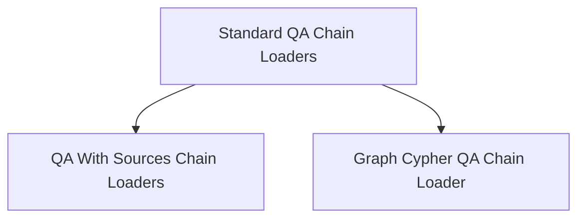

# QA Chains Loading Module

The `qa_chains_loading` module is responsible for dynamically loading and configuring various Question Answering (QA) chain implementations within the LangChain Classic framework. It provides specialized functions to initialize different types of QA chains, including those that integrate with retrievers, vector databases, and graph databases, often incorporating mechanisms for citing sources.

## Architecture

The module is structured into several sub-modules, each focusing on loading a specific category of QA chains. This modular design enhances maintainability and allows for clear separation of concerns, making it easier to extend with new chain types.

<!-- DIAGRAM_JSON
{
    "direction": "TD",
    "nodes": [
        {"id": "standard_qa_loaders", "label": "Standard QA Chain Loaders", "type": "module", "link": "standard_qa_loaders.md"},
        {"id": "qa_with_sources_loaders", "label": "QA With Sources Chain Loaders", "type": "module", "link": "qa_with_sources_loaders.md"},
        {"id": "graph_qa_loader", "label": "Graph Cypher QA Chain Loader", "type": "module", "link": "graph_qa_loader.md"}
    ],
    "edges": [
        {"source": "standard_qa_loaders", "target": "qa_with_sources_loaders"},
        {"source": "standard_qa_loaders", "target": "graph_qa_loader"}
    ],
    "groups": []
}
-->

## Sub-modules

This module comprises the following sub-modules:

*   **[Standard QA Chain Loaders](standard_qa_loaders.md)**: This sub-module contains functions for loading general-purpose Question Answering (QA) chains that retrieve and combine documents to generate answers.
*   **[QA With Sources Chain Loaders](qa_with_sources_loaders.md)**: This sub-module focuses on loading QA chains that not only provide answers but also attribute them to their original source documents, enhancing transparency and trustworthiness.
*   **[Graph Cypher QA Chain Loader](graph_qa_loader.md)**: This specialized sub-module handles the loading of QA chains designed to query graph databases using Cypher, enabling complex question answering over structured graph data.

## Module Relationships

The `qa_chains_loading` module primarily interacts with other modules by loading chain configurations and potentially integrating with components from the `core_retrievers`, `core_vectorstores`, and `classic_chains_base` modules, depending on the specific QA chain being loaded. It serves as a crucial bridge for instantiating runnable QA components based on predefined configurations.