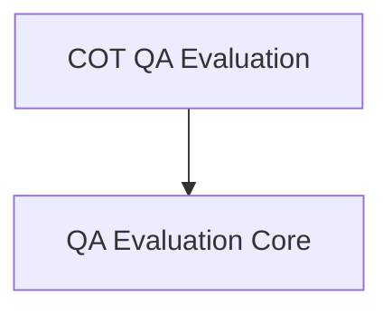

# QA Evaluation Chains

This module (`qa_evaluation_chains`) provides foundational components for evaluating question-answering systems. It includes mechanisms for standard QA evaluation and specialized Chain of Thought (COT) based evaluation, enabling robust assessment of language model performance.

## Architecture

The `qa_evaluation_chains` module is structured into two primary sub-modules:

1.  **QA Evaluation Core (`qa_evaluation_chains_core.md`)**: This sub-module contains the core `QAEvalChain` responsible for general question answering evaluation.
2.  **COT QA Evaluation (`cot_qa_eval_chain.md`)**: This sub-module provides the `CotQAEvalChain`, which extends the basic evaluation with Chain of Thought reasoning.

<!-- DIAGRAM_JSON
{
    "direction": "TD",
    "nodes": [
        {"id": "qa_evaluation_chains_core", "label": "QA Evaluation Core", "type": "module", "link": "qa_evaluation_chains_core.md"},
        {"id": "cot_qa_eval_chain", "label": "COT QA Evaluation", "type": "module", "link": "cot_qa_eval_chain.md"}
    ],
    "edges": [
        {"source": "cot_qa_eval_chain", "target": "qa_evaluation_chains_core"}
    ],
    "groups": []
}
-->

## Sub-modules

Here's a brief overview of the sub-modules within `qa_evaluation_chains`:

### QA Evaluation Core

The `qa_evaluation_chains_core` sub-module defines the `QAEvalChain`, a versatile LLM chain designed for general question-answering evaluation. It acts as a `StringEvaluator` and `LLMEvalChain`, allowing for comprehensive assessment of predictions against reference answers and inputs. This module is essential for basic accuracy checks and integrating evaluation into larger systems.

### COT QA Evaluation

The `cot_qa_eval_chain` sub-module introduces the `CotQAEvalChain`, which enhances the standard QA evaluation by incorporating Chain of Thought (COT) reasoning. This specialized chain leverages an LLM to generate step-by-step reasoning during the evaluation process, providing deeper insights into why a particular answer is deemed correct or incorrect. It is particularly useful for evaluating complex reasoning tasks.