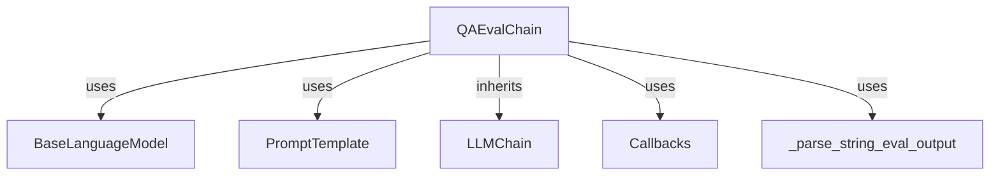

# `qa_evaluation_chains_core` Module Documentation

## Introduction

The `qa_evaluation_chains_core` module provides the core functionality for evaluating question-answering systems. Its primary component, `QAEvalChain`, leverages Language Models (LLMs) to assess the correctness of generated answers against a set of reference answers and original queries. This module is crucial for quantitatively measuring the performance of QA models and chains.

## `QAEvalChain` Component

### Purpose and Core Functionality

The `QAEvalChain` class is a specialized LLMChain designed for evaluating the correctness of question-answering outputs. It acts as a `StringEvaluator` and `LLMEvalChain`, indicating its capability to evaluate string-based predictions using an underlying Language Model.

Key functionalities include:

- **LLM-Powered Evaluation**: Utilizes a provided Language Model (LLM) to perform the actual evaluation, typically by comparing the predicted answer, the reference answer, and the original query.
- **Reference-Based Evaluation**: Mandates the presence of a reference (ground truth) answer for comparison.
- **Input-Aware Evaluation**: Considers the original input query during the evaluation process.
- **Batch Evaluation**: Can evaluate multiple question-answering examples and predictions in a single call.
- **Output Parsing**: Processes the raw output from the LLM into a structured dictionary, making the evaluation results easily consumable.

### Architecture and Component Relationships

`QAEvalChain` inherits from `LLMChain`, `StringEvaluator`, and `LLMEvalChain`, allowing it to integrate seamlessly into existing LangChain architectures while providing specific QA evaluation capabilities.

<!-- DIAGRAM_JSON
{
    "direction": "TD",
    "nodes": [
        {"id": "qa_eval_chain", "label": "QAEvalChain", "type": "component", "link": null},
        {"id": "base_language_model", "label": "BaseLanguageModel", "type": "external", "link": "core_language_models.md"},
        {"id": "prompt_template", "label": "PromptTemplate", "type": "external", "link": "core_prompts.md"},
        {"id": "llm_chain", "label": "LLMChain", "type": "external", "link": "classic_chains_base.md"},
        {"id": "callbacks", "label": "Callbacks", "type": "external", "link": "core_callbacks.md"},
        {"id": "eval_output_parser", "label": "_parse_string_eval_output", "type": "external", "link": "classic_evaluation_parsing.md"}
    ],
    "edges": [
        {"source": "qa_eval_chain", "target": "base_language_model", "label": "uses"},
        {"source": "qa_eval_chain", "target": "prompt_template", "label": "uses"},
        {"source": "qa_eval_chain", "target": "llm_chain", "label": "inherits"},
        {"source": "qa_eval_chain", "target": "callbacks", "label": "uses"},
        {"source": "qa_eval_chain", "target": "eval_output_parser", "label": "uses"}
    ],
    "groups": []
}
-->

### Integration with the Overall System

The `qa_evaluation_chains_core` module, specifically `QAEvalChain`, integrates into the broader LangChain ecosystem as a specialized evaluation tool. It primarily interacts with:

- **Language Models ([core_language_models.md](core_language_models.md))**: It requires an instance of `BaseLanguageModel` to perform its evaluation logic, leveraging the LLM's ability to reason and compare texts.
- **Prompt Templates ([core_prompts.md](core_prompts.md))**: It uses `PromptTemplate` to construct the specific prompt fed to the LLM for evaluation, ensuring all necessary context (query, answer, reference) is provided.
- **LLM Chains ([classic_chains_base.md](classic_chains_base.md))**: Being a subclass of `LLMChain`, `QAEvalChain` inherently benefits from the chain's execution and callback mechanisms.
- **Callbacks ([core_callbacks.md](core_callbacks.md))**: It supports callbacks for tracing and monitoring the evaluation process.
- **Evaluation Parsing ([classic_evaluation_parsing.md](classic_evaluation_parsing.md))**: It relies on helper functions like `_parse_string_eval_output` (likely from `classic_evaluation_parsing`) to interpret the raw LLM output into a structured evaluation result.

This module is typically used in scenarios where developers need to automatically assess the quality and correctness of answers generated by their QA systems, providing a programmatic way to get feedback on model performance.