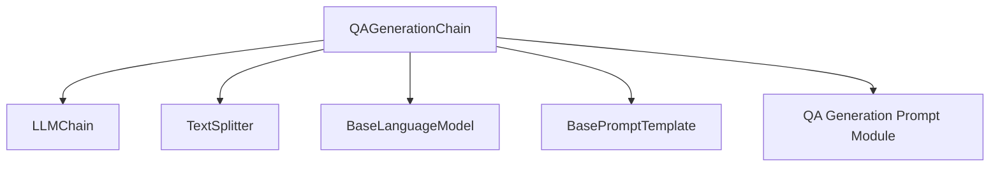

# qa_generation_chain_module

## Introduction
The `qa_generation_chain_module` houses the `QAGenerationChain` class, a core component in the `langchain_classic` ecosystem for generating question-answer pairs from provided text. This module is part of the specialized data processing chains, designed to automate the creation of QA datasets.

**Note:** The `QAGenerationChain` class is deprecated. Developers are encouraged to use the more flexible and modern `langchain_core.runnables` based implementation for new projects, which offers better support for asynchronous operations, streaming, and robust output parsing.

## Module Purpose and Core Functionality
The primary purpose of the `qa_generation_chain_module` is to provide a mechanism for automatically generating questions and answers from a given body of text. It achieves this by:
1.  Splitting the input text into manageable chunks using a `TextSplitter`.
2.  Passing these chunks to an underlying `LLMChain` to generate relevant questions.
3.  Parsing the LLM's output to extract structured QA pairs.

This module is particularly useful for tasks such as:
*   Creating training data for QA models.
*   Summarizing long documents into key questions.
*   Enabling rapid content analysis by identifying core interrogatives.

## Architecture and Component Relationships

The `QAGenerationChain` is built upon several foundational components:

<!-- DIAGRAM_JSON
{
    "direction": "TD",
    "nodes": [
        {"id": "qa_generation_chain", "label": "QAGenerationChain", "type": "component", "link": null},
        {"id": "llm_chain", "label": "LLMChain", "type": "external", "link": "classic_chains_base.md"},
        {"id": "text_splitter", "label": "TextSplitter", "type": "external", "link": "text_splitters_base.md"},
        {"id": "base_language_model", "label": "BaseLanguageModel", "type": "external", "link": "core_language_models.md"},
        {"id": "base_prompt_template", "label": "BasePromptTemplate", "type": "external", "link": "core_prompts.md"},
        {"id": "qa_gen_prompt", "label": "QA Generation Prompt Module", "type": "external", "link": "qa_generation_prompt_module.md"}
    ],
    "edges": [
        {"source": "qa_generation_chain", "target": "llm_chain"},
        {"source": "qa_generation_chain", "target": "text_splitter"},
        {"source": "qa_generation_chain", "target": "base_language_model"},
        {"source": "qa_generation_chain", "target": "base_prompt_template"},
        {"source": "qa_generation_chain", "target": "qa_gen_prompt"}
    ],
    "groups": []
}
-->

### `QAGenerationChain`
The central class in this module. It orchestrates the process of QA generation.
*   **`llm_chain`**: An instance of `LLMChain` ([classic_chains_base.md](classic_chains_base.md)) responsible for interacting with the language model to generate questions based on text chunks.
*   **`text_splitter`**: An instance of `TextSplitter` ([text_splitters_base.md](text_splitters_base.md)), by default `RecursiveCharacterTextSplitter`, which breaks down large input texts into smaller, manageable segments.
*   **`from_llm` class method**: A factory method to conveniently create a `QAGenerationChain` instance from a `BaseLanguageModel` ([core_language_models.md](core_language_models.md)) and an optional `BasePromptTemplate` ([core_prompts.md](core_prompts.md)). It utilizes a `PROMPT_SELECTOR` (from [qa_generation_prompt_module.md](qa_generation_prompt_module.md)) to select an appropriate prompt.

## How the Module Fits into the Overall System
The `qa_generation_chain_module` is situated within `classic_chains_specialized.data_processing_chains`. It represents a classic approach to generating QA data, offering a high-level abstraction over LLM interactions and text processing.

Given its deprecated status, it serves as a foundational example for more modern and flexible implementations utilizing `langchain_core.runnables`. The recommended alternative highlights a shift towards a more modular and composable architecture for building language model applications.

## Related Modules and Alternative Implementation
While `QAGenerationChain` provides a complete solution, its deprecation points to a preferred modern approach. This alternative leverages `langchain_core` components for enhanced flexibility and performance:

*   **`langchain_core.output_parsers.JsonOutputParser`**: For robust parsing of LLM outputs, especially in streaming scenarios. See [core_output_parsers.md](core_output_parsers.md).
*   **`langchain_core.runnables`**: A suite of powerful primitives (`RunnableLambda`, `RunnableParallel`, `RunnablePassthrough`, `RunnableEach`) for constructing complex, composable, and asynchronous chains. See [core_runnables.md](core_runnables.md).
*   **`langchain_openai.ChatOpenAI`**: An example of a `BaseLanguageModel` for chat-based interactions. See [partners_openai_chat_models.md](partners_openai_chat_models.md).
*   **`langchain_text_splitters.RecursiveCharacterTextSplitter`**: The recommended text splitting strategy. See [text_splitters_base.md](text_splitters_base.md).
*   **`langchain_classic.chains.qa_generation.prompt`**: Provides the prompt templates used for QA generation. See [qa_generation_prompt_module.md](qa_generation_prompt_module.md).

The example provided in the `QAGenerationChain` docstring demonstrates how to construct a similar QA generation pipeline using these modern components, emphasizing the advantages of `langchain_core.runnables` for better extensibility and performance.