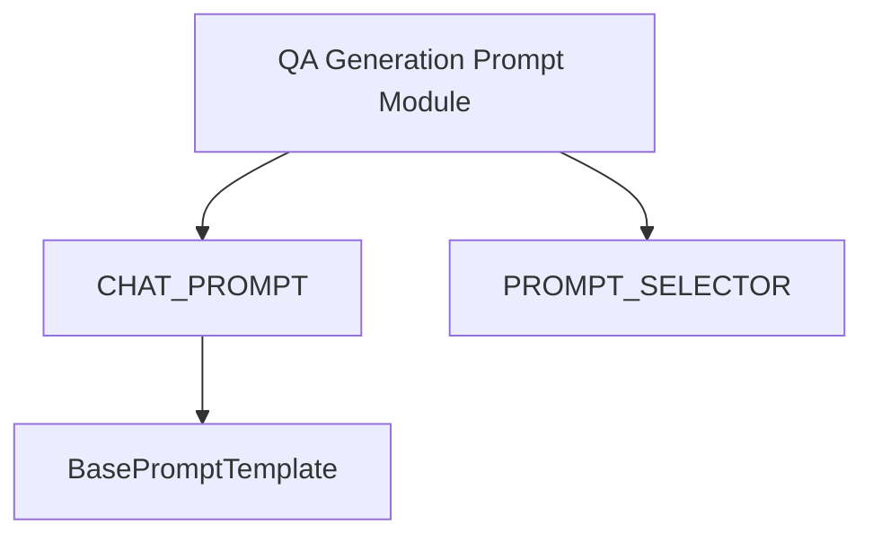

# qa_generation_prompt_module

## Introduction
The `qa_generation_prompt_module` contains the prompt templates and selection logic specifically designed for the question-answer generation process within the `langchain_classic` ecosystem. It provides the linguistic instructions necessary for Language Models (LLMs) to effectively generate questions from given text segments.

## Module Purpose and Core Functionality
This module's primary role is to define and manage the prompts used by QA generation chains, such as the deprecated `QAGenerationChain`.

Key functionalities include:
*   **Prompt Definitions**: Storing pre-defined prompt templates (`CHAT_PROMPT`, `PROMPT`) optimized for QA generation tasks.
*   **Prompt Selection**: Providing a `PROMPT_SELECTOR` mechanism to choose the most appropriate prompt based on the language model being used.

## Architecture and Component Relationships

<!-- DIAGRAM_JSON
{
    "direction": "TD",
    "nodes": [
        {"id": "qa_gen_prompt_module", "label": "QA Generation Prompt Module", "type": "component", "link": null},
        {"id": "chat_prompt", "label": "CHAT_PROMPT", "type": "component", "link": null},
        {"id": "prompt_selector", "label": "PROMPT_SELECTOR", "type": "component", "link": null},
        {"id": "base_prompt_template", "label": "BasePromptTemplate", "type": "external", "link": "core_prompts.md"}
    ],
    "edges": [
        {"source": "qa_gen_prompt_module", "target": "chat_prompt"},
        {"source": "qa_gen_prompt_module", "target": "prompt_selector"},
        {"source": "chat_prompt", "target": "base_prompt_template"}
    ],
    "groups": []
}
-->

### Key Components:
*   **`CHAT_PROMPT`**: A specific prompt template designed for chat-based language models to generate questions.
*   **`PROMPT_SELECTOR`**: A utility that dynamically selects the appropriate prompt (e.g., `CHAT_PROMPT` or a legacy `PROMPT`) based on the characteristics of the LLM being utilized.

## How the Module Fits into the Overall System
The `qa_generation_prompt_module` is a foundational dependency for any QA generation chain within the `langchain_classic` framework. It ensures that language models receive correctly formatted and effective instructions to perform their task, thereby directly influencing the quality of generated QA pairs. It works in conjunction with modules like `qa_generation_chain_module` ([qa_generation_chain_module.md](qa_generation_chain_module.md)) to complete the QA generation pipeline.
