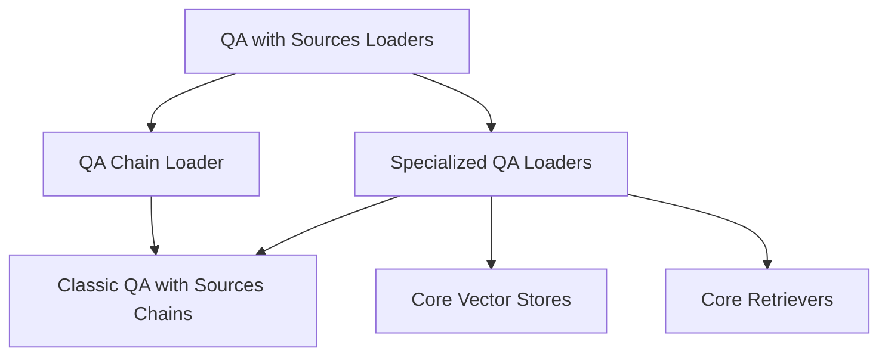

# QA with Sources Loaders Module

This module is responsible for loading various Question Answering (QA) chains that provide answers along with their sources. It abstracts the complexity of initializing different types of QA chains, making it easier to integrate robust QA functionalities into applications.

## Architecture

The `qa_with_sources_loaders` module is part of the `classic_chains_loading` package. It provides functions to instantiate QA chains, including those that interact with vector databases and general retrievers, by configuring and loading `combine_documents_chain` instances.

The module is structured into the following sub-modules:

*   **[QA Chain Loader](qa_chain_loader.md)**: Handles the loading of a generic QA with Sources chain.
*   **[Specialized QA Loaders](specialized_qa_loaders.md)**: Manages the loading of QA with Sources chains tailored for vector databases and retrievers.

<!-- DIAGRAM_JSON
{
    "direction": "TD",
    "nodes": [
        {"id": "qa_with_sources_loaders", "label": "QA with Sources Loaders", "type": "module", "link": "qa_with_sources_loaders.md"},
        {"id": "qa_chain_loader", "label": "QA Chain Loader", "type": "module", "link": "qa_chain_loader.md"},
        {"id": "specialized_qa_loaders", "label": "Specialized QA Loaders", "type": "module", "link": "specialized_qa_loaders.md"},
        {"id": "classic_chains_qa_with_sources", "label": "Classic QA with Sources Chains", "type": "module", "link": "classic_chains_qa_with_sources.md"},
        {"id": "core_vectorstores", "label": "Core Vector Stores", "type": "module", "link": "core_vectorstores.md"},
        {"id": "core_retrievers", "label": "Core Retrievers", "type": "module", "link": "core_retrievers.md"}
    ],
    "edges": [
        {"source": "qa_with_sources_loaders", "target": "qa_chain_loader"},
        {"source": "qa_with_sources_loaders", "target": "specialized_qa_loaders"},
        {"source": "qa_chain_loader", "target": "classic_chains_qa_with_sources"},
        {"source": "specialized_qa_loaders", "target": "classic_chains_qa_with_sources"},
        {"source": "specialized_qa_loaders", "target": "core_vectorstores"},
        {"source": "specialized_qa_loaders", "target": "core_retrievers"}
    ],
    "groups": []
}
-->

