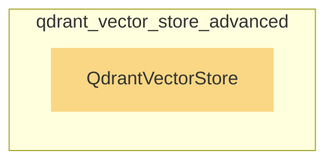

# qdrant_vector_store_advanced
This module provides an advanced integration with Qdrant, offering a robust vector store for efficient similarity search and document management. It supports various configurations for indexing and client parameters.

<!-- DIAGRAM_JSON
{
    "nodes": [
        {
            "id": "QdrantVectorStore",
            "label": "QdrantVectorStore",
            "type": "component"
        }
    ],
    "edges": [],
    "groups": [
        {
            "id": "qdrant_vector_store_advanced",
            "label": "qdrant_vector_store_advanced",
            "nodes": [
                "QdrantVectorStore"
            ]
        }
    ]
}
-->
