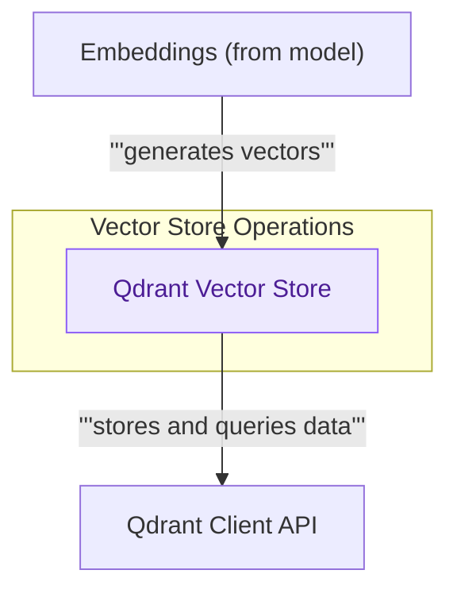

## Qdrant Vector Store (Standard)

This module provides a standard Qdrant vector store, facilitating efficient storage, retrieval, and similarity search of documents. It integrates with embedding models for text vectorization and interacts with the Qdrant client for persistent data management and querying.

<!-- DIAGRAM_JSON
{
    "direction": "TD",
    "nodes": [
        {
            "id": "qdrant_store",
            "label": "Qdrant Vector Store",
            "type": "component",
            "link": null
        },
        {
            "id": "embeddings",
            "label": "Embeddings (from model)",
            "type": "external",
            "link": "models_and_embeddings.md"
        },
        {
            "id": "qdrant_client",
            "label": "Qdrant Client API",
            "type": "external",
            "link": null
        }
    ],
    "edges": [
        {
            "source": "embeddings",
            "target": "qdrant_store",
            "label": "generates vectors"
        },
        {
            "source": "qdrant_store",
            "target": "qdrant_client",
            "label": "stores and queries data"
        }
    ],
    "groups": [
        {
            "id": "vector_ops",
            "label": "Vector Store Operations",
            "role": "analytical",
            "nodes": [
                "qdrant_store"
            ]
        }
    ]
}
-->

