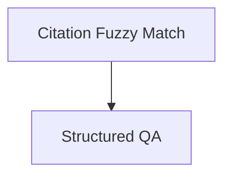

# Question Answering Module

## Introduction
The `question_answering` module, part of `classic_chains_openai_functions`, provides robust functionalities for generating answers with citations and structured outputs using OpenAI functions. It is designed to enhance the accuracy and traceability of generated responses by linking them directly to their source context.

## Architecture
The `question_answering` module is composed of two primary sub-modules: `citation_fuzzy_match` and `qa_with_structure`. These sub-modules work in conjunction to provide flexible and powerful question-answering capabilities.

<!-- DIAGRAM_JSON
{
    "direction": "TD",
    "nodes": [
        {"id": "citation_fuzzy_match", "label": "Citation Fuzzy Match", "type": "module", "link": "citation_fuzzy_match.md"},
        {"id": "qa_with_structure", "label": "Structured QA", "type": "module", "link": "qa_with_structure.md"}
    ],
    "edges": [
        {"source": "citation_fuzzy_match", "target": "qa_with_structure"}
    ],
    "groups": []
}
-->

## Sub-modules

### [Citation Fuzzy Match](citation_fuzzy_match.md)
This sub-module focuses on creating chains and runnables that can answer questions with correct and exact citations by employing fuzzy matching techniques. It ensures that the generated answers are directly attributable to the provided context.

### [Structured QA](qa_with_structure.md)
The `qa_with_structure` sub-module provides functionalities for creating question-answering chains that return answers with structured outputs, specifically including sources. This helps in presenting information in an organized and verifiable manner.
