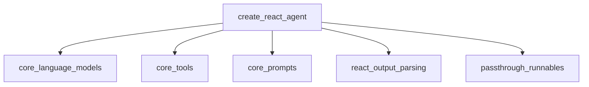

# react_agent_creation Module Documentation

## Introduction

The `react_agent_creation` module provides the `create_react_agent` function, a utility for constructing agents that follow the ReAct (Reasoning and Acting) prompting paradigm. This module is part of the `classic_agents.react_agents` sub-system within the LangChain Classic framework. It facilitates the creation of agents capable of both reasoning about a problem and taking actions using a set of provided tools to arrive at a solution.

**Note:** This implementation is based on the foundational ReAct paper but is an older version and is not recommended for production applications. For more robust and feature-rich implementations, refer to the `create_agent` function from the main `langchain` library.

## Architecture and Component Relationships

The `create_react_agent` function serves as the primary entry point for constructing a ReAct agent. It orchestrates several core components to define the agent's behavior and execution flow.

At its core, `create_react_agent` takes the following key inputs:
- An `llm` (Language Model) of type `BaseLanguageModel` from the [core_language_models](core_language_models.md) module, which serves as the agent's reasoning engine.
- A sequence of `tools` of type `BaseTool` from the [core_tools](core_tools.md) module, representing the actions the agent can perform.
- A `prompt` of type `BasePromptTemplate` from the [core_prompts](core_prompts.md) module, which guides the agent's thought process and action generation.
- An optional `output_parser`, which defaults to `ReActSingleInputOutputParser` from the [react_output_parsing](react_output_parsing.md) module. This parser is responsible for interpreting the LLM's output and converting it into a structured `AgentAction` or `AgentFinish`.
- A `tools_renderer` function, which formats the available tools into a string representation suitable for inclusion in the prompt. The default renderer is `render_text_description`.
- A `stop_sequence` parameter, which can be configured to stop the LLM's generation at specific tokens, typically "Observation:" to prevent hallucinations.

The function constructs a `Runnable` sequence, which represents the agent's operational flow:

1.  **Input Assignment**: It starts with a `RunnablePassthrough` from the [passthrough_runnables](passthrough_runnables.md) module to dynamically assign the `agent_scratchpad`. This scratchpad contains the history of previous agent actions and tool outputs, formatted into a string, enabling the agent to maintain context and refine its reasoning.
2.  **Prompt Application**: The processed input, including the `agent_scratchpad`, is then fed into the `prompt`. The prompt is dynamically partialed with the `tools` and `tool_names` before being passed to the LLM.
3.  **LLM Execution**: The `llm` (potentially bound with stop sequences) processes the fully constructed prompt.
4.  **Output Parsing**: Finally, the LLM's raw output is passed to the `output_parser` (either the default `ReActSingleInputOutputParser` or a custom one) to interpret the agent's next action or final answer.

### Required Prompt Variables

For the `create_react_agent` function to operate correctly, the provided `prompt` must include the following input variables:
-   `tools`: A string containing descriptions and arguments for all available tools.
-   `tool_names`: A comma-separated string of all tool names.
-   `agent_scratchpad`: A string representing the history of the agent's thoughts, actions, and observations.

## How the Module Fits into the Overall System

The `react_agent_creation` module is a fundamental part of the `classic_agents` ecosystem, specifically within the `react_agents` sub-module. It provides the mechanism to instantiate ReAct-based agents, which are a specific type of agent strategy for enhancing LLM capabilities.

Agents created using `create_react_agent` are typically wrapped within an `AgentExecutor` (from the `classic_agents` module, though not a core component of this specific sub-module) to manage their execution, tool invocation, and interaction loop. This allows the ReAct agent to iteratively reason, act, and observe, making it suitable for tasks requiring multi-step problem-solving and interaction with external tools.

It integrates with:
-   **[core_language_models](core_language_models.md)**: Provides the underlying language model for the agent's reasoning.
-   **[core_tools](core_tools.md)**: Supplies the callable functions and resources the agent can utilize.
-   **[core_prompts](core_prompts.md)**: Defines the conversational structure and instructions for the agent.
-   **[react_output_parsing](react_output_parsing.md)**: Offers the logic to parse the LLM's output into actionable commands or final responses.
-   **[passthrough_runnables](passthrough_runnables.md)**: Used to manage and transform the agent's input and intermediate steps within the runnable sequence.

<!-- DIAGRAM_JSON
{
    "direction": "TD",
    "nodes": [
        {"id": "create_react_agent_func", "label": "create_react_agent", "type": "component", "link": null},
        {"id": "core_language_models", "label": "core_language_models", "type": "external", "link": "core_language_models.md"},
        {"id": "core_tools", "label": "core_tools", "type": "external", "link": "core_tools.md"},
        {"id": "core_prompts", "label": "core_prompts", "type": "external", "link": "core_prompts.md"},
        {"id": "react_output_parsing", "label": "react_output_parsing", "type": "external", "link": "react_output_parsing.md"},
        {"id": "passthrough_runnables", "label": "passthrough_runnables", "type": "external", "link": "passthrough_runnables.md"}
    ],
    "edges": [
        {"source": "create_react_agent_func", "target": "core_language_models"},
        {"source": "create_react_agent_func", "target": "core_tools"},
        {"source": "create_react_agent_func", "target": "core_prompts"},
        {"source": "create_react_agent_func", "target": "react_output_parsing"},
        {"source": "create_react_agent_func", "target": "passthrough_runnables"}
    ],
    "groups": []
}
-->

